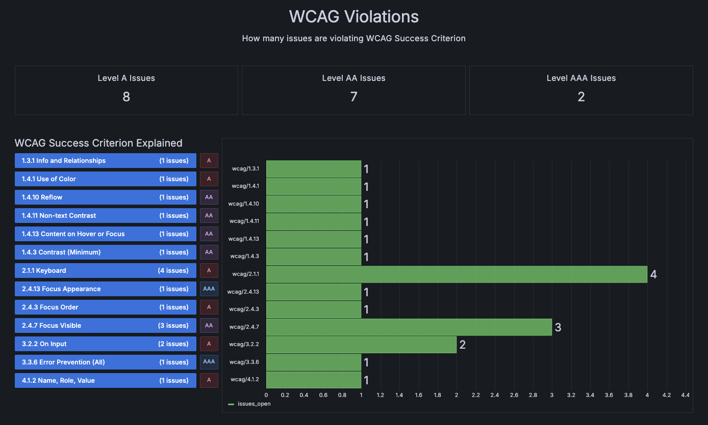
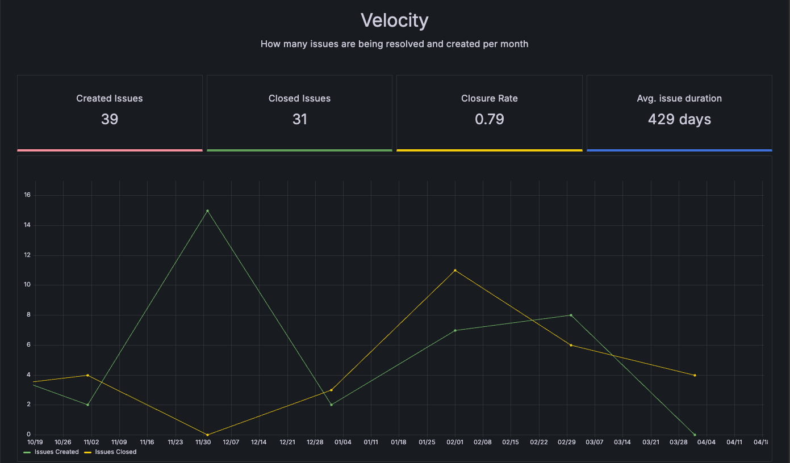

# Accessibility Issue Tracker

Still under active development to get into an alpha version.

This is an opionated Grafana Plugin that allows you to track accessibility issues in your web application utilizing GitHub and a dedicated workflow to manage your issues.

