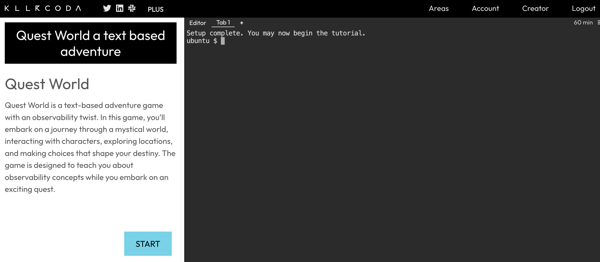
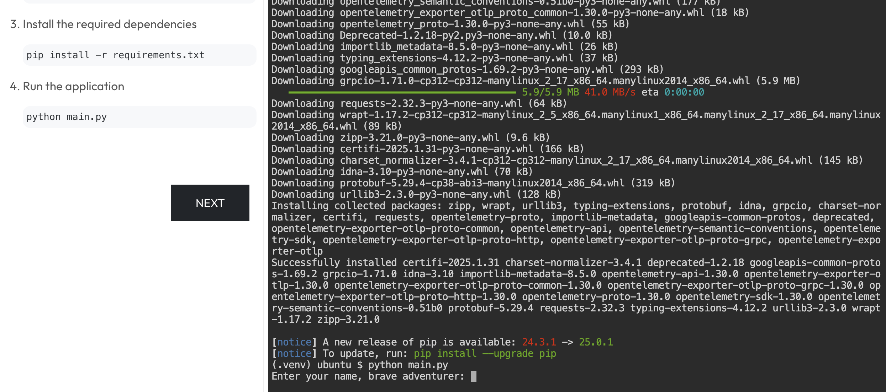
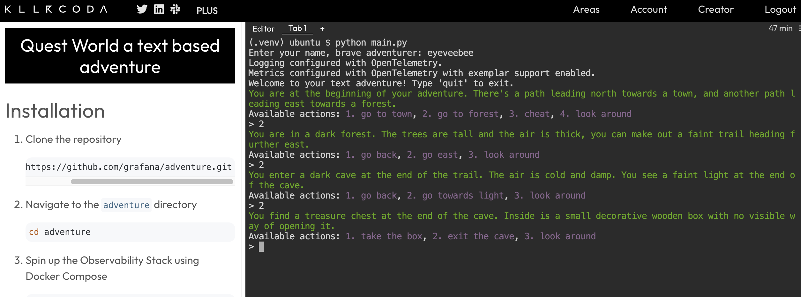
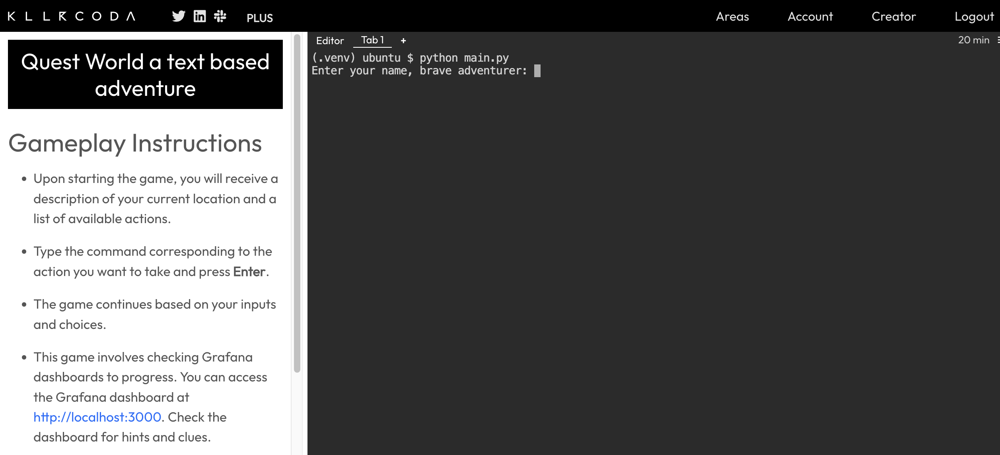
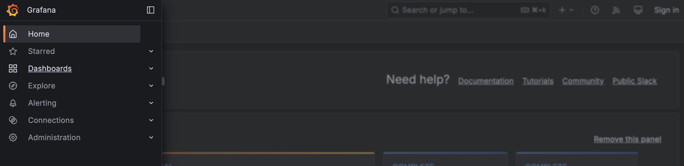
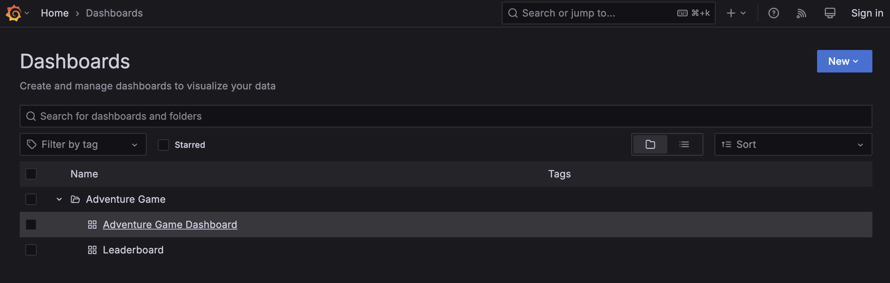
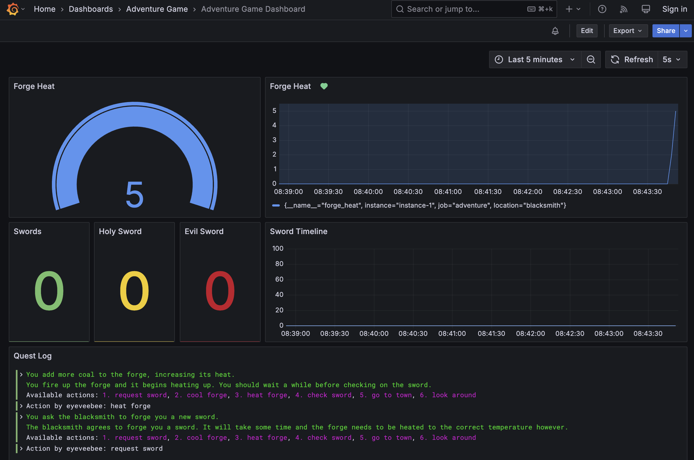

# Killercoda Quest World

Once you start the sandbox at https://killercoda.com/grafana-labs/course/workshops/adventure, wait for the setup to finish and hit the `START` button.

After you hit the start button, follow the setup instructions. Once the setup is finished, you can start playing the adventure.

You can hit the `NEXT` button for instructions, including how to open the Grafana dashboard. Hit the link to open the Grafana instance.

Open the Grafana top left menu and select `Dashboards`.

Under `Adventure Game` select `Adventure Game Dashboard`.

You should see the pre-built Grafana Adventure dashboard, which will help you play the game.

If you don't have a premium account, you have 60 minutes to finish the adventure, GO!
