# Workshop Instructions

If you are running the quest adventure as a hands-on workshop, we suggest the following workflow.

## 1. Set up your environment

If you have git, Docker, and Docker Compose on your laptop, you can set up to run the workshop locally. Follow these [instructions](./README.md#run-with-docker) and check [how to play the game](./README.md#gameplay-instructions).

Otherwise, you can play the game in your browser with a [killercoda session](https://killercoda.com/grafana-labs/course/workshops/adventure) - it lasts 1 hour with a free-tier account. To play the game in your browser, follow the instructions in [this document](./killercoda-sandbox.md).

## 2. Explore Observability tools while playing

The goal of the game is to save the town, for that:

- You need to forge an awesome sword
- Make it more powerful
- Take on a quest
- Defeat the wizard to save the town!

And you'll realise observing the game can actually help you make smarter decisions and save the town faster.

While playing, you may spot an easter egg, so keep an eye for it as it has an exclusive badge for you, or, if doing the workshop in-person, it might get you some Grafana swag. Ask your instructor/s!

And since this is not just for fun (or is it?), we have some questions for you to answer while playing the game. Here they are:

1. **What metrics are helpful to play the game?** While using Grafana to visualize how you are doing with the game, you can use the Grafana-provided dashboard `Adventure Game Dashboard` to observe what is going on.

    <details><summary>Answer</summary>
    <p>
    We can use the forge heat to check if we are over-heating the forge and melting the sword: 

    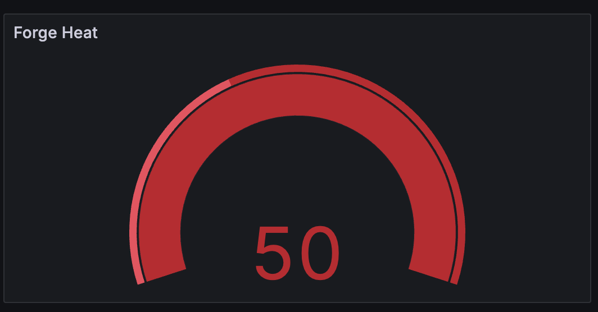
    
    And the sword metrics (number of swords, and type: holy or evil) to help us defeat the wizard:
    
    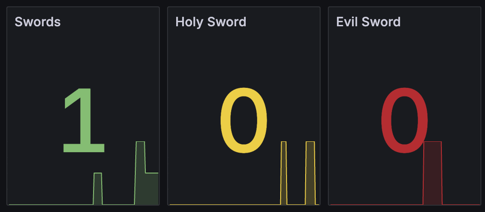
    </p>
    </details>

2. If we accept the offer, it might seem like it's a good one from what the game responds. **What useful log appears when we take the offer from the mysterious man in the village?** Can we review the logs in our Grafana dashboard to confirm that the mysterious man has actually assisted us in our quest?  **What do we see in the metrics that also point to an unexpected outcome of accepting the offer?**

    <details><summary>Answer</summary>
    <p>
    When we accept the offer from the mysterious man, what we see in the game is:

    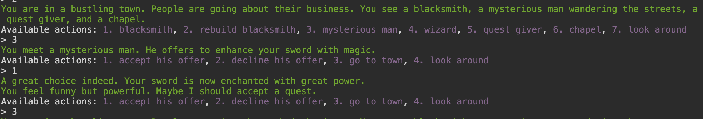

    If we have a look at the logs, though, we can see a `warn` log:

    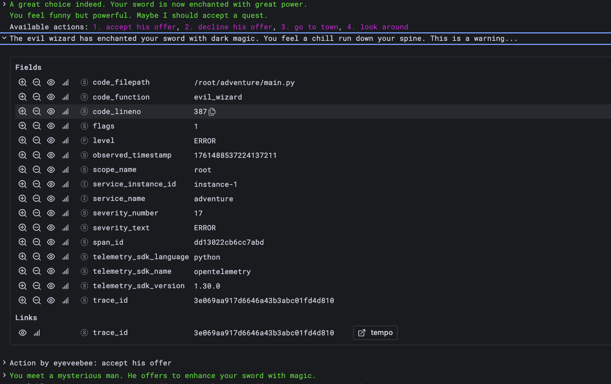

    And in our metrics, we would see we now have an evil sword:

    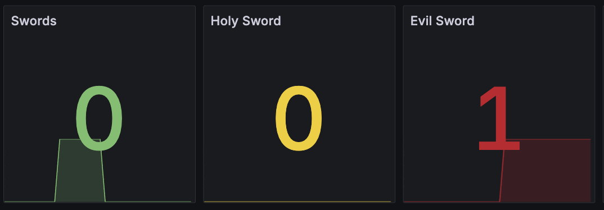

    </p>
    </details>

3. **What dashboard allows us to view traces in the game (hint: it's the other provisioned Grafana dashboard)?**

    <details><summary>Answer</summary>
    <p>
    The dashboard named `Leaderboard` will allow us to check end-to-end the traces for each game we play.

    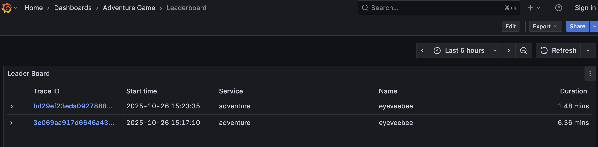


    Clicking on each game, we can see the actions taken as spans and the timings for each span.

    

    </p>
    </details>


4. **Where can we find an [exemplar](https://grafana.com/docs/grafana/latest/fundamentals/exemplars) in the `Adventure Game Dashboard` and what can we view using it?**

    <details><summary>Answer</summary>
    <p>

    In the `Sword Timeline` panel (`Adventure Game Dashboard`), you will be able to hover over each metric associated to a change in sword (get one, make it evil, make it holy, etc.):

    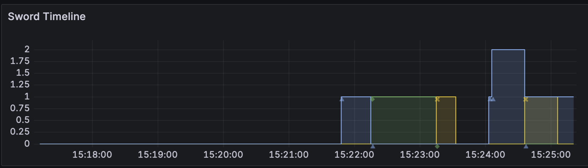

    Any of those opens a window with the associated exemplar:

    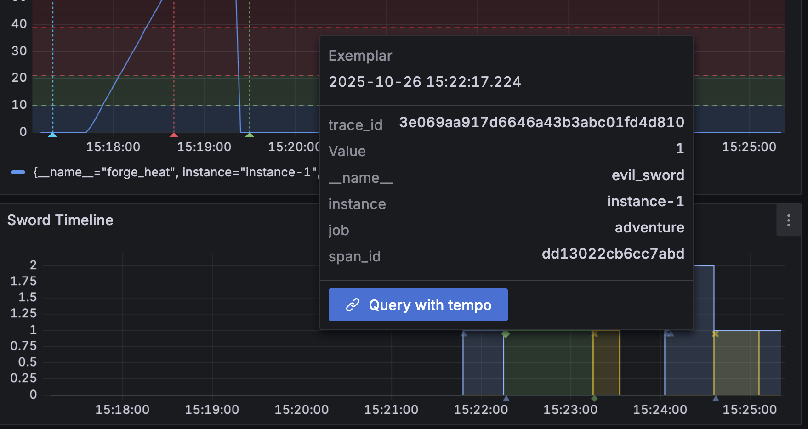

    You can click the `Query with tempo` button to view the full trace and the span for that metric. 

    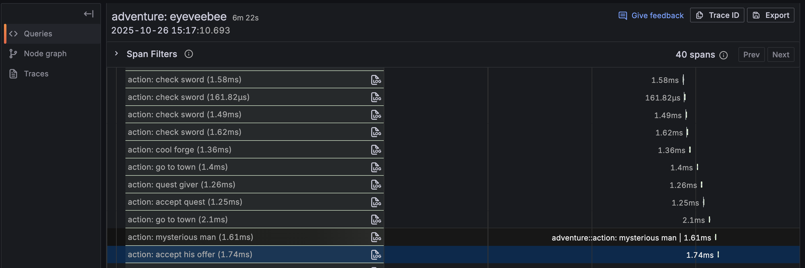

    In the example above, we would be able to see that the sword became enchanted/evil when the player chose to accept the mysterious man's offer.

    </p>
    </details>

5. **How do we navigate from logs to traces in the `Adventure Game Dashboard`?**

    <details><summary>Answer</summary>
    <p>

    Similarly to the previous metrics exemplars, it is possible to navigate from a log to its traces. In the log pane, choose a log, for example, the one where we have the priest in the church look at our work:

    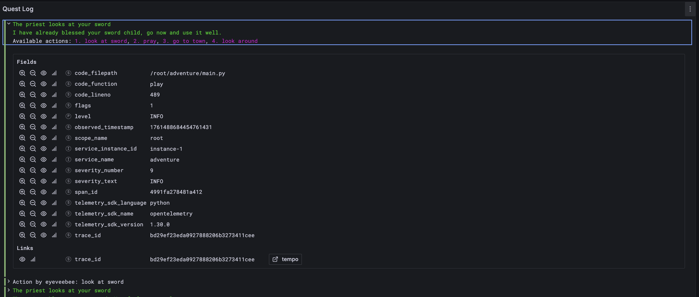

    And we can click the `tempo` button to see the trace:

    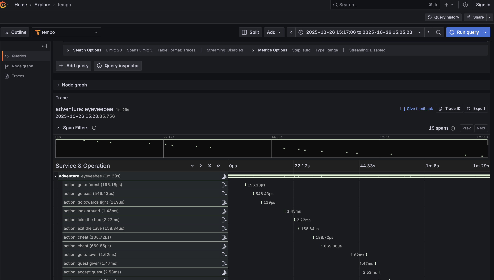

    </p>
    </details>

6. **How do we navigate telemetry signals in Grafana without using [logQL](https://grafana.com/docs/loki/latest/query/), [promQL](https://grafana.com/blog/2020/02/04/introduction-to-promql-the-prometheus-query-language/), or [traceQL](https://grafana.com/docs/tempo/latest/traceql/)?** How can we explore the collected metrics, logs, or traces without using the [Grafana Explore](https://grafana.com/docs/grafana/latest/explore/) menu?

    <details><summary>Answer</summary>
    <p>

    Grafana simplified logs, metrics, traces, and profiles exploration with the [drilldown suite](https://grafana.com/docs/grafana/latest/explore/simplified-exploration). 
    
    In our case, we can select the Grafana menu [`Drilldown - Metrics`](https://grafana.com/docs/grafana/latest/explore/simplified-exploration/metrics/) to check the instrumented metrics in the game:  

    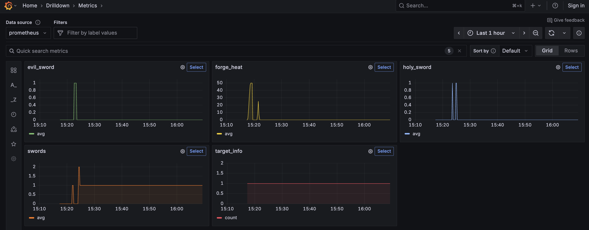

    Similarly with [`Drilldown - Logs`](https://grafana.com/docs/grafana/latest/explore/simplified-exploration/logs/)

    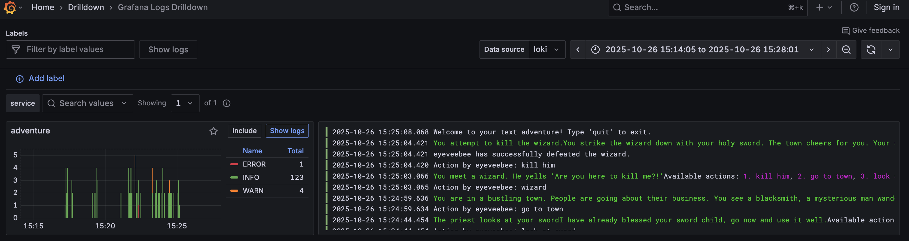

    And [`Drilldown - Traces`](https://grafana.com/docs/grafana/latest/explore/simplified-exploration/traces/)

    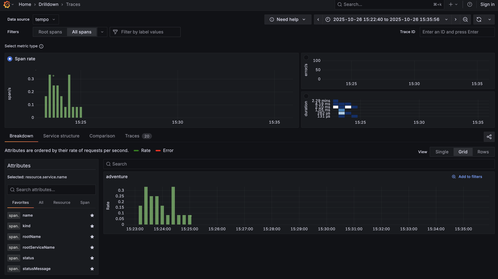

    </p>
    </details>

7. **Did we have any useful alerts set up in Grafana that could have prevented a meltdown?**

    <details><summary>Answer</summary>
    <p>

    We have set some alerts for you. When we overheat the forge, in the `Forge Heat` timeline panel (`Adventure Game Dashboard`), you will see where the alerts triggered:

    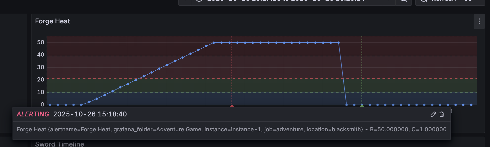
    
    and when they were back to an ok status:

    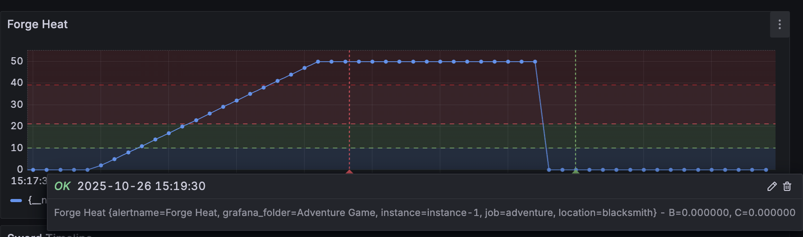

    And we can check the alerts' configuration by going to the `Alerting - Alert rules` menu.

    

    We could check the history by clicking on the `Show state history` button.

    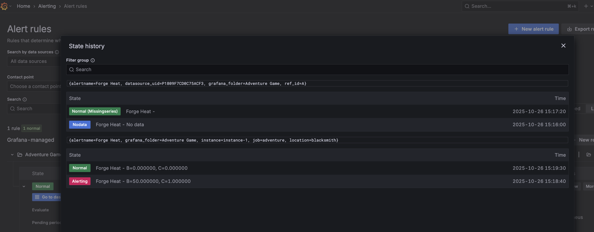
 
    </p>
    </details>

8. **Did anyone spot an Easter egg in the `Adventure Game Dashboard` logs view? Can you decipher the message to receive your exclusive badge/prize?**

    <details><summary>Answer</summary>
    <p>

    Can you make the easter egg appear in the log panel? 

    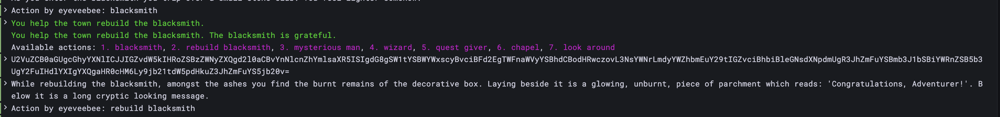

    And if you can, can you decode the secret message? If so, show your log to the instructor and you might get a prize, alongside an exclusive [community forum](https://community.grafana.com/) badge for quest adventurers.
 
    </p>
    </details>


## 3. Don't just play, add a new metric

Now that you have mastered the game, it's time to add a new metric. We propose adding a cheat counter to display the number of times a user cheats in the game. However, you can also be creative and add another metric that you find helpful, which we may have missed, or other logs. And why not? You can attempt to add a new telemetry signal, [profiles](https://grafana.com/oss/pyroscope/), implementing a [profiling challenge](https://github.com/grafana/adventure/issues/8).

If you decide to add a `cheat attempts` metric, we suggest looking at how we created the other counters (sword counts) and having a look at the [OpenTelemetry specifications for metrics API](https://opentelemetry.io/docs/specs/otel/metrics/api). Once you implement the new metric, add a Grafana panel to our `Adventure Game Dashboard`. You'll need to first add the metric at [main.py](../main.py), and then add the Grafana panel to the dashboard. It would look like:

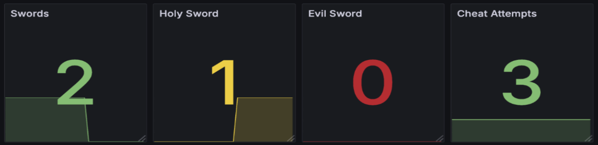


<details><summary>Tips</summary>
<p>

```diff

class AdventureGame:
    def __init__(self):
        
+         # Track the number of times the user cheats
+         self.cheat_count = 0
        
+         # Create a cheat counter
+         self.cheat_counter = meter.create_up_down_counter(
+             name="cheat_attempts",
+             description="The total number of times the adventurer has cheated"
+         )
+         self.cheat_counter.add(0)  # Initialize the sword counter to 0
        
    ...
    
    def observe_evil_swords(self, observer):
        sword_count = 0
        if self.has_evil_sword:
            sword_count = 1
        elif self.has_holy_sword or self.has_sword:
            sword_count = 0
        # Standard observation - exemplars will be handled automatically by the SDK
        return [metrics.Observation(value=sword_count, attributes={})]

+     def observe_cheats(self, observer):
+         # Standard observation - exemplars will be handled automatically by the SDK
+         return [metrics.Observation(value=self.cheat_counter, attributes={})]

    def cheat(self):
        self.has_sword = True
+         # Increment the cheat counter and record the metric
+         self.cheat_count += 1
+         self.cheat_counter.add(1) 
        self.sword_counter.add(1)  # Increment sword counter when cheating
        return "You should continue north, you cheater."

```

To add a cheat attempt counter, a quick way is to edit the Grafana dashboard, and `Duplicate` one of the panels (e.g., `Evil Sword`), and then change the metric name to the one you have created for cheat attempts.

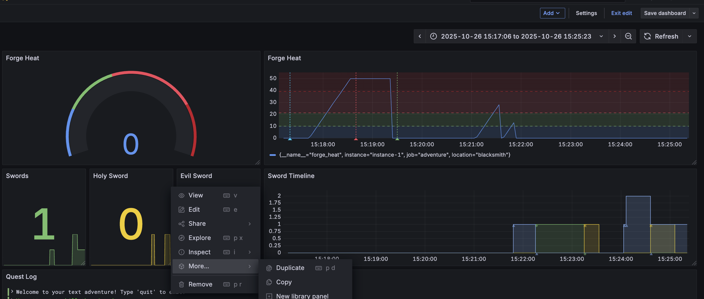

</p>
</details>

## 4. I want more games!

The quest adventure is excellent to learn logs and metrics, and we felt we needed to build another game to showcase traces: [Learn OpenTelemetry tracing through a grand strategy game: introducing Game of Traces](https://grafana.com/blog/2025/08/11/learn-opentelemetry-tracing-through-a-grand-strategy-game-introducing-game-of-traces/). 

You can play this game similarly, either run it locally with Docker, following the [instructions for the game of tracing](https://github.com/grafana/alloy-scenarios/blob/main/game-of-tracing/README.md#running-the-demo), or use our [killercoda playground](https://killercoda.com/grafana-labs/course/workshops/game-of-traces) from your browser. 


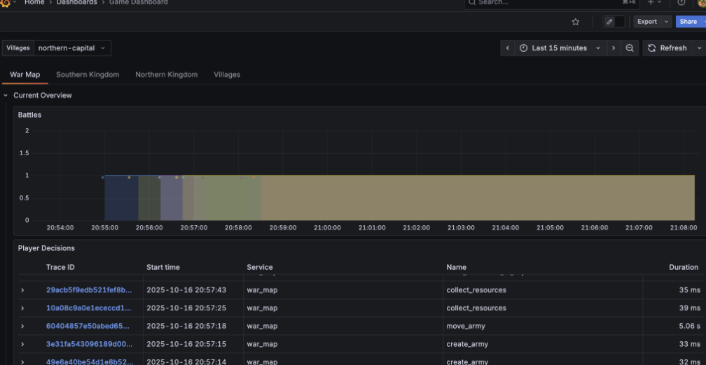
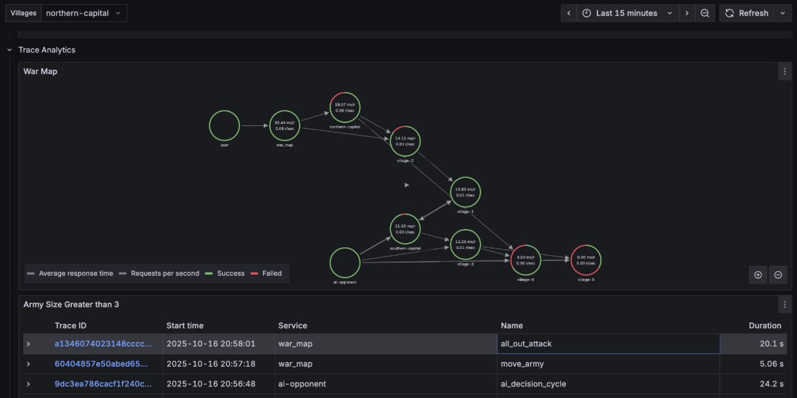

Have fun!
