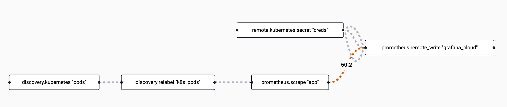
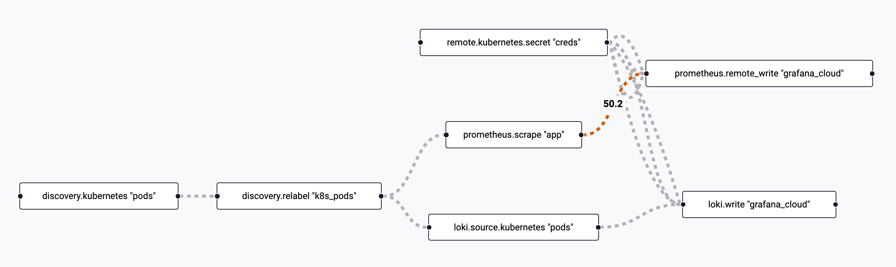

---
---

# 1.2. Pull-based Telemetry

We'll be working with both push and pull-based telemetry in this workshop. We'll be using the pull model for Prometheus metrics, Kubernetes pod logs, and Pyroscope profiles. This requires discovering a list of targets, then configuring scrapers to collect telemetry from each one.


## Step 1: Discover Kubernetes Pods

Our QuickPizza application is running in Kubernetes, meaning we can take advantage of Alloy's [discovery.kubernetes](https://grafana.com/docs/alloy/latest/reference/components/discovery/discovery.kubernetes/) component to discover all of the pods that compose our application. Let's open up our fleet pipeline and get started!

:::tip[Documentation Reference]

These Grafana Alloy docs may prove useful as you configure service discovery:
* [discovery.kubernetes](https://grafana.com/docs/alloy/latest/reference/components/discovery/discovery.kubernetes/#namespaces) component reference
* [Pod labels](https://grafana.com/docs/alloy/latest/reference/components/discovery/discovery.kubernetes/#pod-role) returned by `discovery.kubernetes`
* [discovery.relabel](https://grafana.com/docs/alloy/latest/reference/components/discovery/discovery.relabel/) component reference

:::

1.  Navigate to **Connections -> Collector -> Fleet Management** in the left-hand menu.

1.  You will land on the **Inventory** page, where you will see the Alloy instance assigned to you.

    Click the **Remote Configuration** tab to list the pipelines we have configured.

1.  Click the **Edit** (pencil icon) button next to the **lab_scrape_telemetry** pipeline to open the partially built pipeline we'll be modifying.

1.  In the `discovery.kubernetes` component, **add a namespace selector** to return only pods in the `quickpizza` namespace below the `TODO` comment.
    <details>
        <summary>See the solution</summary>
        ```
          namespaces {
            names = ["quickpizza"]
          }
        ```
    </details>

1.  In the `discovery.relabel` component, add a new rule to set the **pod's name** as the label `pod`.
    <details>
        <summary>See the solution</summary>
        ```
          rule {
            source_labels = ["__meta_kubernetes_pod_name"]
            target_label  = "pod"
          }
        ```
    </details>

1.  In the `discovery.relabel` component, add a new rule to set the **pod container's name** as the label `container`.
    <details>
        <summary>See the solution</summary>
        ```
          rule {
            source_labels = ["__meta_kubernetes_pod_container_name"]
            target_label  = "container"
          }
        ```
    </details>

1.  In the `discovery.relabel` component, add a new rule to set the **value of the pod label** `app.kubernetes.io/instance` as the label `service_name`.
    <details>
        <summary>See the solution</summary>
        ```
          rule {
            source_labels = ["__meta_kubernetes_pod_label_app_kubernetes_io_instance"]
            target_label  = "service_name"
          }
        ```
    </details>

1.  Click the **Test configuration pipeline** button to validate the config.

1.  Click the **Next** button to move to the next step.

1.  No changes are needed to the assigned attributes, so click the **Save** button.

1.  From the **Remote configuration** screen, click the toggle icon under **Active** for the **lab_scrape_telemetry** pipeline.

1.  In the modal that pops up, click the **Activate** button.

### Check your work

Now that we have service discovery configured for our Kubernetes cluster, let's check the Alloy UI to see what it found.

1.  Open the browser tab for the Grafana Alloy UI and click **Remote Configuration** in the top navigation.

1.  Click the **View** button next to the **lab_scrape_telemetry.default** pipeline.

1.  Click the blue **Graph** button just below the name of the pipeline on the details page.

1.  **Verify** you see boxes for the `discovery.kubernetes` and `discovery.relabel` components. (You can ignore the `remote.kubernetes.secret` block as we haven't used it yet)

    

1.  **Click the box** for the `discovery.relabel` component.

1.  Click the **Exports** link in the left navigation.

1.  Review the outputted targets and confirm you see the labels we added such as **pod**, **container**, and **service_name**.

## Step 2: Scraping Metrics

Now that we have all of our QuickPizza application pods discovered, we're ready to configure Alloy to scrape Prometheus metrics from the application pods. By default, Alloy will scrape the `/metrics` path via HTTP on each port exposed by each pod.

:::tip[Documentation Reference]

These Grafana Alloy docs may prove useful as you scrape metrics:
* [prometheus.scrape](https://grafana.com/docs/alloy/latest/reference/components/prometheus/prometheus.scrape/) component reference
* [discovery.relabel](https://grafana.com/docs/alloy/latest/reference/components/discovery/discovery.kubernetes/#exported-fields) exported fields
:::

1.  Navigate to **Connections -> Collector -> Fleet Management** in the left-hand menu.

1.  Click the **Remote Configuration** tab to list the pipelines we have configured.

1.  Click the **Edit** (pencil icon) button next to the **lab_scrape_telemetry** pipeline to open the partially built pipeline we'll be modifying.

1.  **Paste the contents below** under the **Prometheus Metrics** section in the pipeline.

    This code includes a fully fleshed out `prometheus.remote_write` component using credentials from a Kubernetes secret and a partial `prometheus.scrape` component.
    ```
    prometheus.scrape "app" {
      // TODO: Use the output of the relabled pods 

      // TODO: Forward to Grafana Cloud Metrics

      // TODO: Set scrape interval to 15s

    }

    prometheus.remote_write "grafana_cloud" {
      endpoint {
        url = convert.nonsensitive(remote.kubernetes.secret.creds.data["metrics_url"])

        basic_auth {
          username = convert.nonsensitive(remote.kubernetes.secret.creds.data["metrics_user"])
          password = remote.kubernetes.secret.creds.data["access_token"]
        }
      }
    }
    ```

1.  In the `prometheus.scrape` component, **configure the target** to use the output of our relabeled pods from the previous section. _(Hint: look at the docs to find the exported fields for the `discovery.relabel` component)_
    <details>
        <summary>See the solution</summary>
        ```
          targets = discovery.relabel.k8s_pods.output
        ```
    </details>

1.  In the `prometheus.scrape` component, **configure forwarding** to the **receiver** of `prometheus.remote_write.grafana_cloud`.
    <details>
        <summary>See the solution</summary>
        ```
          forward_to = [prometheus.remote_write.grafana_cloud.receiver]
        ```
    </details>

1.  In the `prometheus.scrape` component, **set the scrape interval to 15s**.
    <details>
        <summary>See the solution</summary>
        ```
          scrape_interval = "15s"
        ```
    </details>

1.  Click the **Test configuration pipeline** button to validate the config.

1.  Click the **Save** button to apply it.

1.  In the modal that pops up warning that your pipeline is active, click **Save** again.

### Check your work

With metrics flowing, let's see what Alloy's live debugging shows.

1.  Open the browser tab for the Grafana Alloy UI and click **Remote Configuration** in the top navigation.

1.  Click the **View** button next to the **lab_scrape_telemetry.default** pipeline.

1.  Click the blue **Graph** button just below the name of the pipeline on the details page.

1.  **Verify** you see the boxes for the newly added Prometheus components.

    

1.  **Click the box** for the `prometheus.scrape` component.

1.  Click the **Live Debugging** button near the top of the page.

1.  Watch for metrics to appear as they are scraped from the targets by Alloy (within 15 seconds).

1.  **Bonus:** From the Grafana UI, navigate to **Drilldown > Metrics** and see if you can find the newly scraped metrics that begin with **k6quickpizza_**

## Step 3: Collecting Logs

The next signal we'll focus on is logs. Alloy has many ways to accept logs (OpenTelemetry, Syslog, Docker, log files, etc), but we will be using the Kubernetes API due to some of the unique constraints of this workshop.

:::tip[Documentation Reference]

These Grafana Alloy docs may prove useful as you collect logs:
* [loki.source.kubernetes](https://grafana.com/docs/alloy/latest/reference/components/loki/loki.source.kubernetes/) component reference
* [discovery.relabel](https://grafana.com/docs/alloy/latest/reference/components/discovery/discovery.kubernetes/#exported-fields) exported fields
:::

1.  Return to the fleet pipeline you were working with in the previous step.

1.  **Paste the contents below** under the **Kubernetes Pod Logs** section in the pipeline.

    This code includes a fully fleshed out `loki.write` component using credentials from a Kubernetes secret and a partial `loki.source.kubernetes` component.
    ```
    loki.source.kubernetes "pods" {
      // TODO: Target the k8s pods

      // TODO: Forward to Grafana Cloud Logs

    }

    loki.write "grafana_cloud" {
      endpoint {
        url = convert.nonsensitive(remote.kubernetes.secret.creds.data["logs_url"]) + "/loki/api/v1/push"

        basic_auth {
          username = convert.nonsensitive(remote.kubernetes.secret.creds.data["logs_user"])
          password = remote.kubernetes.secret.creds.data["access_token"]
        }
      }
    }
    ```

1.  In the `loki.write` component, **configure the target** to use the output of our relabeled pods from the previous section. _(Hint: this is probably just like what we did for metrics)_
    <details>
        <summary>See the solution</summary>
        ```
          targets = discovery.relabel.k8s_pods.output
        ```
    </details>

1.  In the `loki.write` component, **configure forwarding** to the **receiver** of `loki.write.grafana_cloud`.
    <details>
        <summary>See the solution</summary>
        ```
          forward_to = [loki.write.grafana_cloud.receiver]
        ```
    </details>

1.  Click the **Test configuration pipeline** button to validate the config.

1.  Click the **Save** button to apply it.

1.  In the modal that pops up warning that your pipeline is active, click **Save** again.

### Check your work

With logs being collected now, let's confirm we're ingesting them.

1.  Open the browser tab for the Grafana Alloy UI and click **Remote Configuration** in the top navigation.

1.  Click the **View** button next to the **lab_scrape_telemetry.default** pipeline.

1.  Click the blue **Graph** button just below the name of the pipeline on the details page.

1.  **Verify** you see the boxes for the newly added Loki components.

    

1.  While we can verify the targets for the `loki.write` component, it does not support live debugging in the UI.

    From the Grafana UI, navigate to **Drilldown > Logs** and look for entries for services like `public-api`, `catalog`, and `copy`.

## Wrapping Up

In this lab, you learned how to:

- Configure Fleet Management pipelines
- Configure Kubernetes service discovery
- Use the Alloy UI
- Scrape Prometheus metrics
- Collect Kubernetes pod logs


Click **Next** to continue to the next module.
