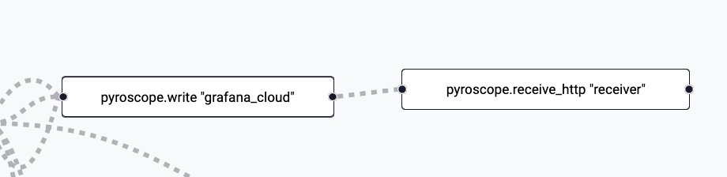

---
---

# 1.3. Push-based Telemetry

Now that we've collected half of our signals using pull-based methods, we'll focus on configuring Alloy to receive traces and profiles from the services in our QuickPizza application.

:::opentelemetry-tip

Grafana Alloy has support numerous [OpenTelemetry components](https://grafana.com/docs/alloy/latest/reference/components/otelcol/). If you're already a user of the OpenTelemetry collector, you can [migrate your existing configuration](https://grafana.com/docs/alloy/latest/set-up/migrate/from-otelcol/) over to Alloy. This allows you to easily keep your existing transformations, filters, etc.

:::

## Step 1: Receive Traces

Our QuickPizza application is already instrumented with the OpenTelemetry SDK and is configured to send traces to Alloy via OTLP. Now we need to configure our Alloy instance to receive those traces and forward them to Grafana Cloud.

:::tip[Documentation Reference]

These Grafana Alloy docs may prove useful:
* [otelcol.receiver.otlp](https://grafana.com/docs/alloy/latest/reference/components/otelcol/otelcol.receiver.otlp/) component reference
* [otelcol.processor.batch](https://grafana.com/docs/alloy/latest/reference/components/otelcol/otelcol.processor.batch/) component reference

:::

1.  Navigate to **Connections -> Collector -> Fleet Management** in the left-hand menu.

1.  You will land on the **Inventory** page, where you will see the Alloy instance assigned to you.

    Click the **Remote Configuration** tab to list the pipelines we have configured.

1.  Click the **Edit** (pencil icon) button next to the **lab_receive_telemetry** pipeline to open the partially built pipeline we'll be modifying.

1.  In the `otelcol.receiver.otlp` component, **configure the HTTP and GRPC receivers** to listen on default addresses/ports.
    <details>
        <summary>See the solution</summary>
        ```
          http { }
          grpc { }
        ```
    </details>

1.  In the `otelcol.receiver.otlp` component, **set the output** to the receiver of the `otelcol.processor.batch` component.
    <details>
        <summary>See the solution</summary>
        ```
          output {
            traces = [otelcol.processor.batch.default.input]
          }
        ```
    </details>

1.  In the `otelcol.processor.batch` component, **set the timeout** to `2s`. This helps reduce the numher of requests to Grafana Cloud and stay within our request rate limits.
    <details>
        <summary>See the solution</summary>
        ```
          timeout = "2s"
        ```
    </details>

1.  In the `otelcol.processor.batch` component, **set the output** to the receiver of the `otelcol.exporter.otlp` component.
    <details>
        <summary>See the solution</summary>
        ```
            traces = [otelcol.exporter.otlp.grafanacloud.input]
        ```
    </details>

1.  Click the **Test configuration pipeline** button to validate the config.

1.  Click the **Next** button to move to the next step.

1.  No changes are needed to the assigned attributes, so click the **Save** button.

1.  From the **Remote configuration** screen, click the toggle icon under **Active** for the **lab_receive_telemetry** pipeline.

1.  In the modal that pops up, click the **Activate** button.

### Check your work

Now that we have profiles being ingested, let's check the Alloy UI to see what it found.

1.  Open the browser tab for the Grafana Alloy UI and click **Remote Configuration** in the top navigation.

1.  Click the **View** button next to the **lab_receive_telemetry.default** pipeline.

1.  Click the blue **Graph** button just below the name of the pipeline on the details page.

1.  **Verify** you see blocks for the `discovery.kubernetes` and `discovery.relabel` components. (You can ignore the `remote.kubernetes.secret` block as we haven't used it yet)

    

1.  **Click the block** for the `discovery.relabel` component.

1.  Click the **Exports** link in the left navigation.

1.  Review the outputted targets and confirm you see the labels we added such as **pod**, **container**, and **service_name**.

## Step 2: Collecting Profiles

For our final signal, we'll configure Alloy to receive profiles. Alloy can also be configured to scrape applications for pprof profiles via HTTP or use alternative mechanisms such as eBPF. In this workshop, we have our QuickPizza application instrumented to send profiles to Alloy.

:::tip[Documentation Reference]

These Grafana Alloy docs may prove useful for scraping profiles:
* [pyroscope.receive_http](https://grafana.com/docs/alloy/latest/reference/components/pyroscope/pyroscope.receive_http/) component reference
* [pyroscope.write](https://grafana.com/docs/alloy/latest/reference/components/pyroscope/pyroscope.write/#exported-fields) exported fields
:::

1.  Return to the fleet pipeline you were working with in the previous step.

1.  **Paste the contents below** under the **Profiles** section in the pipeline.

    This code includes a fully fleshed out `pyroscope.write` component using credentials from a Kubernetes secret and a partial `pyroscope.receive_http` component.
    ```
    pyroscope.receive_http "receiver" {
      // TODO: Configure the HTTP listener for port 4040

      // TODO: Configure forwarding to the receiver 
      
    }

    pyroscope.write "grafana_cloud" {
      endpoint {
        url = convert.nonsensitive(remote.kubernetes.secret.creds.data["profiles_url"])

        basic_auth {
          username = convert.nonsensitive(remote.kubernetes.secret.creds.data["profiles_user"])
          password = remote.kubernetes.secret.creds.data["access_token"]
        }
      }
    }
    ```

1.  In the `pyroscope.receive_http` component, **configure the HTTP receiver** to listen on **port 4040**.
    <details>
        <summary>See the solution</summary>
        ```
          http {
            listen_port = 4040
          }
        ```
    </details>

1.  In the `pyroscope.receive_http` component, **configure forwarding** to the **receiver** of `pyroscope.write.grafana_cloud`.
    <details>
        <summary>See the solution</summary>
        ```
          forward_to = [pyroscope.write.grafana_cloud.receiver]
        ```
    </details>

1.  Click the **Test configuration pipeline** button to validate the config.

1.  Click the **Save** button to apply it.

1.  In the modal that pops up warning that your pipeline is active, click **Save** again.

### Check your work

Now that we have profiles being ingested, let's check the Alloy UI to see what it found.

1.  Open the browser tab for the Grafana Alloy UI and click **Remote Configuration** in the top navigation.

1.  Click the **View** button next to the **lab_receive_telemetry.default** pipeline.

1.  Click the blue **Graph** button just below the name of the pipeline on the details page.

1.  **Verify** you see the blocks for the newly added Pyroscope components.

    

1.  To confirm we've received data, we will navigate to **Drilldown > Profiles** and look for entries for services like `public-api`, `catalog`, and `copy`.


## Wrapping Up

In this lab, you learned how to:

- Configure the OTLP receiver for traces
- Configure the batch processor
- Configure the Pyroscope receiver and writer
- Use Drilldown in Grafana Cloud


Click **Next** to continue to the next module.
