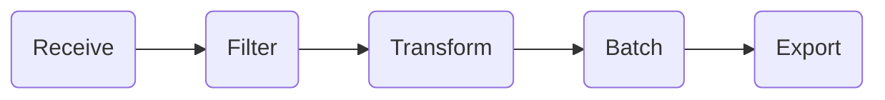

---
---

# 2.2. Using OpenTelemetry Processors

Switching signals to traces, Grafana Alloy supports many of the components of the OpenTelemetry Collector. This includes commonly used processors such as `transform` or `filter`. We already have a `batch` processor in our traces pipeline, so in this lab we'll add a `transform` processor to modify trace spans.

An example flow of an OpenTelemetry pipeline:


## Transforming Trace Spans

One common use case for transformations in observability pipelines is normalizing attributes on a span. In a perfect world, every application and service would be instrumented in a consistent way, using the same attribute names and conventions for things like service names, HTTP methods, or user IDs. However, in reality, teams often use different libraries, frameworks, or naming conventions, which can lead to inconsistencies in the telemetry data collected from various sources.

This is where processors become invaluable. They allow you to modify, rename, or even remove attributes from spans as they pass through the pipeline. This normalization step ensures that downstream systems like Grafana receive telemetry data in a consistent format, making it easier to query, analyze, and visualize.

In this part of the lab, you'll learn how to use the `transform` processor to standardize span attributes, making your trace data more useful and easier to work with across your organization.

:::tip[Documentation Reference]

These Grafana Alloy docs may prove useful:
* [otelcol.processor.transform](https://grafana.com/docs/alloy/latest/reference/components/otelcol/otelcol.processor.transform/) component reference
:::

1.  Navigate to **Connections -> Collector -> Fleet Management** in the left-hand menu.

1.  Click the **Remote Configuration** tab to list the pipelines we have configured.

1.  Click the **Edit** (pencil icon) button next to the **lab_receive_telemetry** pipeline to open the partially built pipeline we'll be modifying.

1.  **Paste the contents below** below the **otelcol.receiver.otlp** component in the pipeline.

    This code includes a partial `otelcol.processor.transform` component.
    ```
    otelcol.processor.transform "default" {
      error_mode = "ignore"

      trace_statements {
        context = "resource"
        statements = [
          // TODO: set "pod" attribute to value of "service.instance.id"
          `set(attributes[""], attributes[""])`,
        ]
      }

      output {
        // TODO: forward to the batch processor
        traces  = []
      }
    }
    ```

1.  In the `otelcol.processor.transform` component, fill in the missing pieces as described by the comments.
    
    - **Set the `pod` attribute** to the value of `service.instance.id`.

    - **Forward the output** to the `otelcol.processor.batch` component.

    
    <details>
        <summary>See the solution</summary>
        ```
        otelcol.processor.transform "default" {
          error_mode = "ignore"

          trace_statements {
            context = "resource"
            statements = [
              // Set "pod" attribute to value of "service.instance.id"
              `set(attributes["pod"], attributes["service.instance.id"])`,
            ]
          }

          output {
            // forward to the batch processor
            traces = [otelcol.processor.batch.default.input]
          }
        }
        ```
    </details>

1.  Now we need to insert our new transform processor into the pipeline.
    In the `otelcol.receiver.otlp` component, update `output` to the newly created component in the previous step.
    <details>
        <summary>See the solution</summary>
        ```
          forward_to = [otelcol.processor.transform.default.input]
        ```
    </details>

1.  Click the **Test configuration pipeline** button to validate the config.

1.  Click the **Save** button to apply it.

1.  In the modal that pops up warning that your pipeline is active, click **Save** again.

### Check your work

With metrics flowing, let's see what Alloy's live debugging shows.

1.  Open the browser tab for the Grafana Alloy UI and click **Remote Configuration** in the top navigation.

1.  Click the **View** button next to the **lab_receive_telemetry.default** pipeline.

1.  Click the blue **Graph** button just below the name of the pipeline on the details page.

1.  **Verify** you see the boxes for the newly added Prometheus components.

1.  **Click the box** for the `prometheus.transform` component.

1.  Click the **Live Debugging** button near the top of the page.

1.  Watch for traces to appear as they flow through this component.

1.  Verify in the data displayed that the newly created `pod` resource attribute is shown

