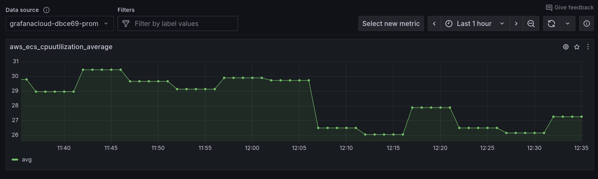
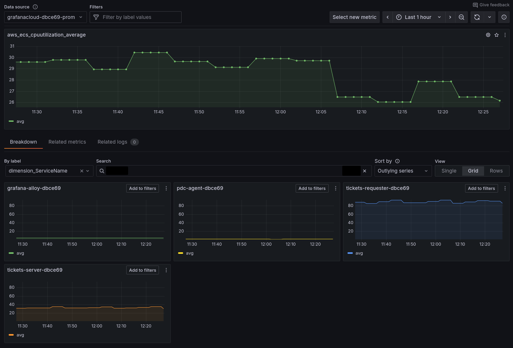

---
---

# 1.3. Exploring the signals

Underneath all of the tools you'll use in this workshop are the core telemetry signals, in the Grafana telemetry databases:

- **Metrics** (Prometheus): Numerical measurements over time
- **Logs** (Loki): Text-based records of events, application logs
- **Traces** (Tempo): Records of request flows across services

Each of these telemetry databases stores signals from your AWS infrastructure and applications.

In this main hands-on section for this lab, you'll get comfortable with exploring these signals in Grafana, and understanding when to use each type. This will help get you ready to troubleshoot problems with these signals, and then build your own dashboard, which you will do in the following labs!

## Step 1: Explore Prometheus metrics

**Metrics** are numerical measurements collected at regular intervals. They're ideal for:

- monitoring system health
- performance trends
- setting alerts

:::info[How it works]

AWS collects tons of metrics by default, and makes them available in CloudWatch.

In this environment, we're pulling CloudWatch metrics into Grafana, using Grafana Cloud's hosted [AWS CloudWatch integration](https://grafana.com/docs/grafana-cloud/monitor-infrastructure/monitor-cloud-provider/aws/cloudwatch-metrics/), which scrapes the metrics from CloudWatch and converts them into Prometheus format.

You can also implement a similar setup yourself, using Grafana Alloy's [`prometheus.exporter.cloudwatch` component](https://grafana.com/docs/alloy/latest/reference/components/prometheus/prometheus.exporter.cloudwatch/).

:::

Let's take a look at some metrics from our AWS services. **Drilldown Metrics** is a queryless, clickable way to explore your AWS metrics in Grafana.

1.  Navigate to **Drilldown** and then click on **Metrics**.

    This page is like your "homepage" for all of your metrics. It shows us all of the metrics currently found in your Grafana Cloud Metrics (Prometheus) data source.

1.  In the search bar, enter `aws_` to search to show all AWS metrics.

1.  Find the **aws_ecs_cpuutilization_average** metric and click on the **Select** button. This will show us the average CPU utilization, across all of our ECS tasks.

    

    Underneath the average CPU utilization graph, in the **Breakdown** tab, note how we can see the the various labels (dimensions) that are associated with this metric.

    These labels allow us to narrow down our search to view metrics from only a specific group or subset of instances.

1.  By **dimension_ServiceName**, click on **Select** to show the metric broken down by each ECS service.

    This will show the average CPU utilization, for each of our ECS services:

    

:::aws-tip[Labels or dimensions?]
_Dimensions_ (like ServiceName, ClusterName) in AWS CloudWatch become _labels_ in Prometheus/Grafana. Both serve the same purpose - they let you filter and group your metrics by different attributes. Think like: CloudWatch's "Group by" functionality, but with more flexibility for creating custom queries.
:::

Now we can instantly see CPU utilization for all of our ECS services, broken down by each service. This lets us immediately see which services are perhaps over, or under utilized.


## Step 2: Explore Loki logs

**Logs** provide detailed context about specific events. They're essential for debugging and understanding what happened at a particular moment.

:::info[How it works]

In this preconfigured workshop environment, we're pushing logs into Grafana Cloud from our AWS services and infrastructure, using the [Loki exporter for ECS Firelens](https://grafana.com/blog/2020/08/06/loki-tutorial-how-to-send-logs-from-amazons-ecs-to-loki/), and the AWS Distribution of OpenTelemetry (ADOT) for Lambda.

These tools allow us to collect logs from our applications deployed as ECS services, and Lambda functions.

:::

Let's use Drilldown Logs to explore logs from our applications on AWS:

1.  Navigate to **Drilldown** and then choose **Logs**.

1.  Click on **tickets-requester** -> **Show Logs** to show logs from the tickets-requester service.

1.  In the **Filter logs by string** box, enter `error`

    Logs containing the string `error` are now displayed.

1.  We can zoom in to find logs from a particular instance of our app. Click on the **Labels** tab.

    Then click on the **container_id** -> **Select** button, which shows logs broken down by each instance of our application.

    This is super-useful when you want to see why one particular instance of your app is having problems.

1.  In the container_id breakdown, click on **include** by the side of one of the container IDs. Then click on the **Logs** tab to just show logs from that instance.

:::aws-tip

While CloudWatch Logs organizes by log groups and streams, Loki uses labels (like `container_id`, `service_name`) to slice and filter your logs. This makes it easier to correlate logs across different AWS services - for example, finding all error logs from both your ECS tasks and Lambda functions in one view, rather than needing to query separate log groups.

:::


## Step 3: Explore OpenTelemetry traces with Tempo

**Traces** show the journey of a request through your distributed system. 

If you've not begun to use traces yet, you'll soon begin to see how powerful they can be in helping you solve stability or performance problems in your application.

:::info[How it works]

We're pulling OpenTelemetry traces into Grafana Cloud using Grafana Alloy. Each of our applications emits traces and forwards them to Alloy. From there, Alloy routes the traces onwards to Grafana Cloud.

You can also ship traces to Grafana Cloud from your applications directly using [Grafana Cloud's OTLP endpoint](https://grafana.com/docs/grafana-cloud/send-data/otlp/send-data-otlp/).

:::

1.  Navigate to **Drilldown** then **Traces**.

1.  The Drilldown Traces homepage shows traces, broken down by service name. 

    :::opentelemetry-tip

    **Service name** is a standard _attribute_ in OpenTelemetry which is used to identify which particular application or service a trace, log or metric is coming from.

    :::

1.  The default view in Drilldown Traces shows the span rate, which is the rate of spans received per second. Click on the **errors/s** panel to change the view.

    Now we see the subset of traces which resulted in an error, broken down by each service.

1.  Finally, click on the **duration** tab. This shows us a histogram.

    A histogram shows the duration of traces, over time. 

    - The x-axis represents time moving forward, from left to right.

    - At each time period, the color intensity of each box shows the relative number of traces that completed in the given time. A more intense color means that more traces completed in this time.

    Using this view, you can see what was _typical_ and what was an _outlier_.

1.  Click on the **slow traces** column which shows the slowest traces from this time range.

1.  Click on a trace and see the execution time of each sub-task within the service, or its interactions with other services.


## Step 4: Correlate logs with traces

The real power of Grafana comes from being able to correlate different signal types, to get a complete picture of your AWS infrastructure and applications.

To perform side-by-side correlations, we can use the **Explore** view in Grafana.

1. Navigate to **Explore**.

2. Select the **Loki** data source, then enter the following query:

    ```
    {service_name="tickets-requester"}
    ```

3.  Click to expand a log line, then click on the button by the side of the *traceID* field, to open the trace browser.

4.  Now we can see exactly what happened during this interaction.


## Wrapping Up

In this lab, you learned:

- How to query and visualize metrics, logs, and traces in Grafana

- The strengths and use cases for each data type

- How to correlate between different signals for faster troubleshooting

Now you're ready to dive into a typical AWS troubleshooting scenario with Grafana Cloud.

