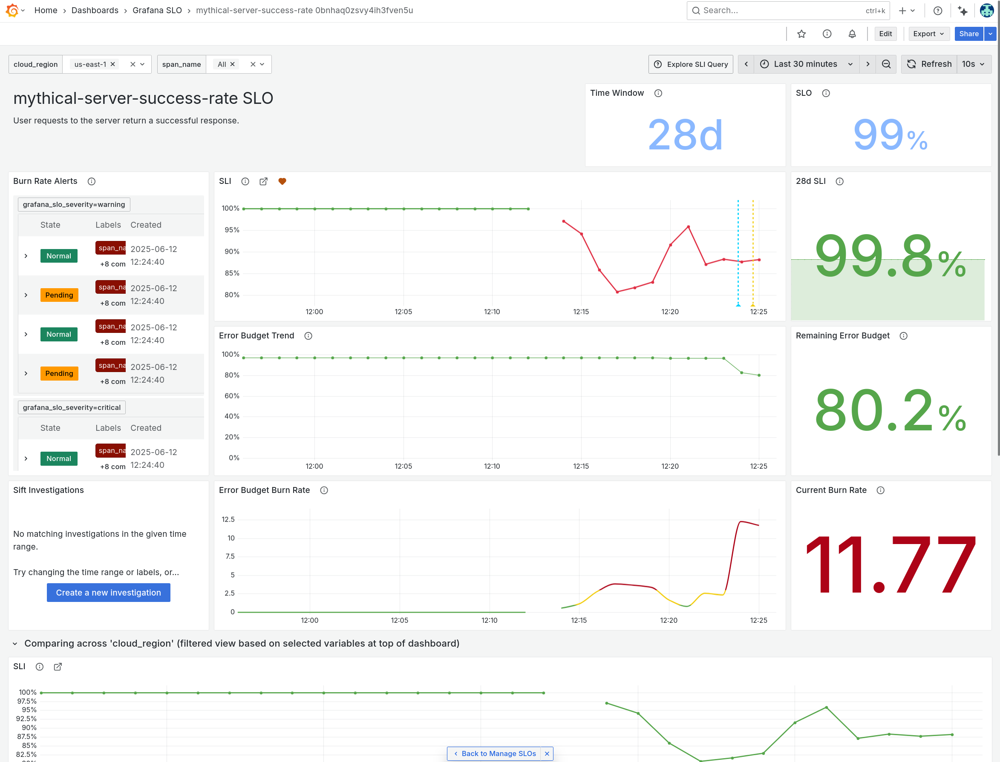
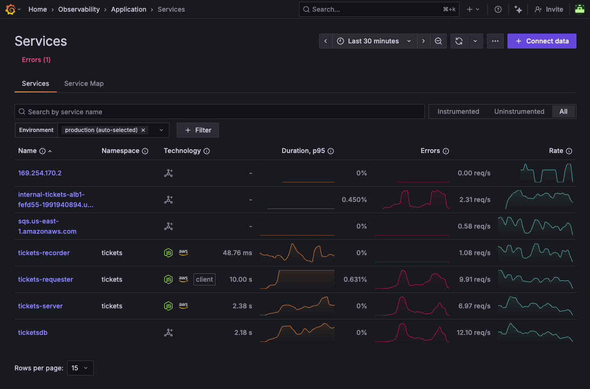
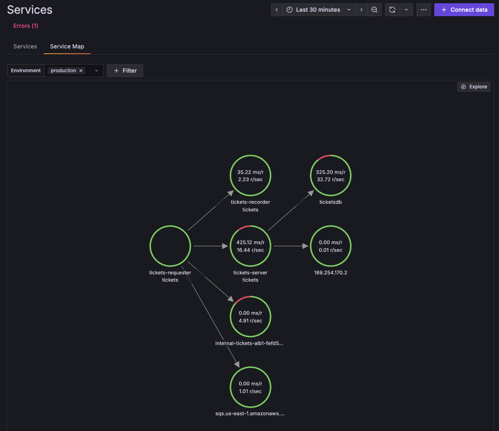
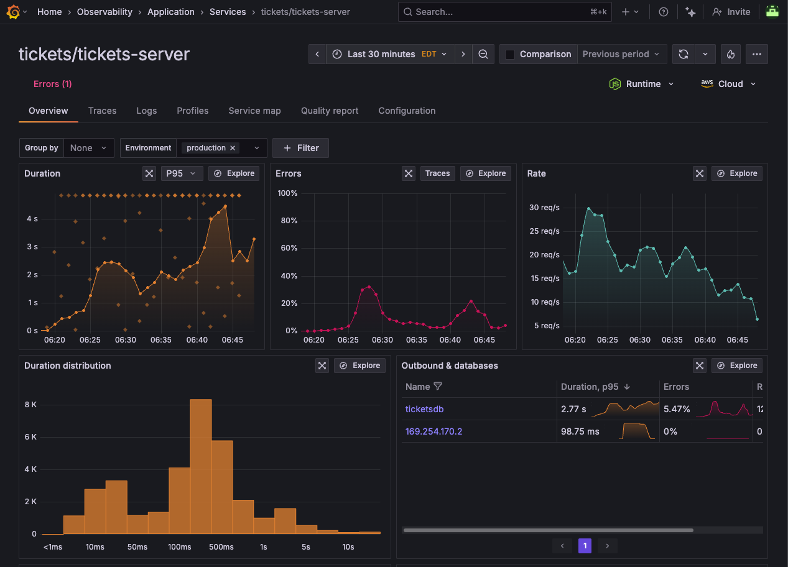
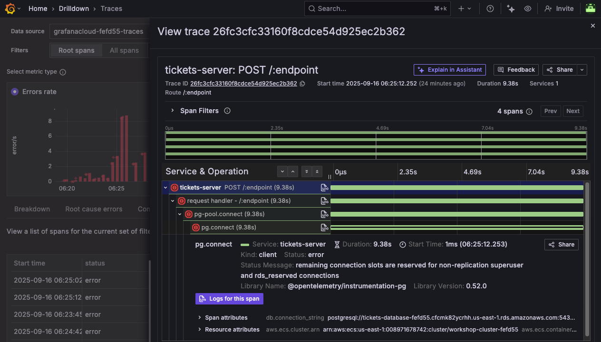

---
---

# 2.1. The Serverless Detective 🕵️

You're monitoring a hybrid serverless application that includes both AWS Lambda functions and ECS Fargate services. The application processes ticket orders through different microservices.

The problem is, something's gone wrong in production! You just joined the company last week, but you've been trusted to figure out what's wrong with the application. Fortunately, you have Grafana Cloud to help.

Dust off your trenchcoat and grab your hat: we're going to see how you might troubleshoot a problem in your AWS serverless infrastructure with Grafana Cloud.

## Step 1: Respond to the alarm

Let's start by responding to an alert. In Grafana Cloud, we can configure proactive alerts on our services, using Service-Level Objectives (SLOs). This allows us to create alerts on things that have **real user impact** instead of just noisy infrastructure alerts.

:::info[What is an SLO?]

A Service Level Objective (SLO) defines a specific, measurable target, which represents the quality-of-service that you provide to your users.

**Grafana SLO** makes it easy to create, manage, monitor, and alert on your Service Level Objectives, right inside Grafana, using almost any query or metric. [Find out more about Grafana SLO ->](https://grafana.com/docs/grafana-cloud/alerting-and-irm/slo/)

:::

1.  From the side menu, navigate to **Alerts & IRM -> SLO -> SLO performance** to show the Grafana SLO performance dashboard.

    This dashboard shows the performance of our Service-Level Objectives. There is **one** SLO configured.

1.  Click on the **tickets-server-success-rate** service to show the SLO dashboard.

    - This dashboard shows us the performance of our ticket booking service, against our target.
    - We have set a service-level objective that 99% of requests to our ticket booking service should be handled successfully.
    - Our SLO is based on the success rate of customer booking requests, so it's something that has real customer impact.
    - When requests begin to fail, it will be highlighted on this dashboard, and an alert will fire.

1.  Oh no! It seems that the *server* service is experiencing issues.

    

1.  Grafana SLO allows us to see a breakdown of the worst-performing instances, groups or endpoints of our service.

    Using the variable dropdowns at the top, try exploring how the SLO dashboard looks, broken down by **region** or **span name** (endpoint).

    For example, we might choose to break down our SLO by region, or by namespace, or by any other label that we have defined in our application's instrumentation.

1.  Scroll down to the graphs section. We can see that the Service Level Indicator (SLI) has dropped for all services.

    In particular, the Event Rate for the `POST /:endpoint` operation is showing much higher than usual. This seems like a good place to start investigating.

Notice that the error budget will be exhausted very soon at the current burn rate. So we need to fix this!


## Step 2: Get the big picture

Let's use Grafana Cloud Application Observability to get the current health of our services running in AWS.

1.  Navigate to **Observability -> Application** to show the Service Inventory page.

    The service inventory is displayed. This allows you to see the health of all your OpenTelemetry-instrumented services, at a glance. 
    
    Whether your services are running on EKS, ECS Fargate, or Lambda, you can see the overall health of your services at a glance in the service inventory.

    **Notice that** some of our services are showing an elevated error rate (denoted by the peaks in the sparkline in the Errors column).

    

1.  Let's get the big picture, to understand how everything is connected. Click on the **Service Map** tab, to show the graph of interconnected services.

    Notice that _tickets-server_ seems to be experiencing an elevated error rate, as it is surrounded by a red circle.

    


1.  Click on the **tickets-server** circle, then from the pop-up menu, click **Service Overview** to show the service details. We can see that this service is experiencing some errors.

    This shows us an aggregate view of all instances of our service, across all regions or availability zones.

    - Notice first how the typical duration of each request has **shot up** to 4 seconds.

    - Look at the Operations panel, which shows us the operations being invoked on this service's API. 

    

1.  Click on the **Cloud** dropdown button at the top right of the screen.

    You will see the various attributes of this service which have been captured by OpenTelemetry: we can see:

    - availability zones
    - platform (ECS, the service that we are using)
    - region
    - Account ID
    - the specific ARNs of the service, so we know exactly what we're looking at

1.  Let's break down the service by availability zone. In the _Group by_ dropdown, select **cloud.availability_zone**. This will show us the error rate for each AWS availability zone.

At this stage, we need more info.


## Step 3: Troubleshoot with OpenTelemetry signals

Now that we can see where the error is happening, and who is affected, let's use the other solutions in Grafana Cloud to figure out what's going on.

Let's navigate to **Drilldown Traces**, which gives us another way to view our trace data.

1.  From the side menu, click on **Drilldown -> Traces**.

    Drilldown Traces gives us an incredibly powerful view for diving into our trace data, allowing us to see the flow of requests through our application, and how they are affected by different services.

    We can slice and dice the trace data in hundreds of different ways, making it easy to find the root cause of issues in our application.

1.  From the Drilldown Traces home page, click on **Errors rate** at the top to change the view to show traces which have errors.

1.  In the Group By section, we can group traces by service, operation, or any other attribute that we have defined in our OpenTelemetry instrumentation.

    The default grouping is _service.name_. But we can also group by _cloud.region_ to see traces grouped by AWS region, or _aws.ecs.task.family_ to see traces grouped by ECS Fargate task.

    By **Group By**, click on **aws.ecs.task.family** to see traces grouped by ECS Fargate task.

1.  By **tickets-server**, click on **Add to filters**.

    This will filter the traces to only show those where the trace began in the tickets-server service.

    Now we're zooming in to the problem.


## Step 4: Digging into error traces

1.  Click on the **Errored traces** tab to show a list of errored traces.

1.  **Click on one of the traces** to see the details. Then expand the trace sections to see the full request flow. It may look something like:

    tickets-server -> request handler -> pg-pool.connect -> pg.connect

    This shows us deep contextual information about requests coming in to our application deployed on ECS.

    
    
1.  Notice how the span is indicated with an error icon, and the error message is shown in the span's **Status Message**.

    > remaining connection slots are reserved for non-replication superuser and rds_reserved connections

    Or, you might also see:

    > timeout exceeded when trying to connect

    This gives us a strong clue that the problem might be with the database connection, which is causing the service to fail.

    :::opentelemetry-tip

    Notice that OpenTelemetry also automatically extracts rich contextual data about this database interaction:

    - db.connection_string: `postgresql://tickets-database-fefd55.cfcmk82ycrhh.us-east-1.rds.amazonaws.com:5432/ticketsdb`
    - db.system: `postgres`
    - net.peer.name: `tickets-database-fefd55.cfcmk82ycrhh.us-east-1.rds.amazonaws.com`

    This kind of contextual information comes from adding OpenTelemetry instrumentation to your applications.

    :::

1.  Notice how many of the spans end at exactly **30 seconds**. Does that seem strange to you?

## Step 5: View managed service logs

From the information in the traces, we suspect it's a database issue, so let's check the health of the RDS database itself.

:::info[How it works]

In this environment, we have configured a Firehose delivery stream to ship RDS logs to Grafana Cloud, so we can view the logs right here in the AWS Observability app.

[See how to stream logs from AWS to Grafana Cloud using Firehose](https://grafana.com/docs/grafana-cloud/monitor-infrastructure/monitor-cloud-provider/aws/logs/firehose-logs/).

:::

1.  Navigate to **Observability -> Cloud Provider -> AWS** then click on the **Logs** tab.

    The Logs tab shows us all of the CloudWatch log groups that we're pulling in to our Grafana Cloud account.

1.  Ensure that the datasource dropdown (at the top right) has **grafanacloud-xxxx-logs** selected.

1.  Click on the log group **/aws/rds/instance/tickets-database-xxxxx/postgresql**

    Notice how we see a lot of FATAL and PANIC error messages:

    - "sorry, too many clients already"
    - "remaining connection slots are reserved for non-replication superuser and rds_reserved connections"
    - "the database system is in recovery mode"

1.  **In the search box**, add the following filter to just show the FATAL messages:

    ```
    FATAL
    ```

    This will just show log lines containing the string FATAL.

    What would your diagnosis be?

1.  Finally, click on **Open in Explore** button, to open the same logs query in Grafana's classic Explore view.


## Step 6: Correlate error logs with metrics

Since we're also bringing in RDS metrics into Grafana Cloud, we can instantly correlate the errors we're seeing in the RDS logs with the health and performance metrics of the database. The metrics should give us an idea of how the database responded to these events.

1.  In the Explore view, click on the **Split** button in the toolbar at the top right.

    _Split view_ allows us to correlate two signals, side-by-side, for easier analysis and understanding.

1.  Using the data source picker at the top, select the **grafanacloud-xxxxx-prom** data source.

1.  Click on the **Metrics browser** button, and in the **Select a metric** box, start typing `aws_rds_`.

    You'll see the box populate with all of the RDS CloudWatch metrics that we can now query as Prometheus metrics.

    :::aws-tip

    Grafana Cloud's CloudWatch integration scrapes your CloudWatch metrics into Prometheus format, adding the appropriate namespace (`aws_rds_`, `aws_ec2`, etc) to your metrics, so you can see them all here.

    :::

1.  Using the metrics browser, select the metric **aws_rds_database_connections_sum**, then click on **dimension_DBInstanceIdentifier** to filter to a specific database, and pick **tickets-database-xxxxx** (where "xxxx" is the same ID as in your Grafana instance URL)

    Finally, click **Use query**.

    OR, you can enter this query directly in the query box, making sure to update "xxxxx" with the ID in your Grafana instance URL:

    ```
    aws_rds_database_connections_sum{dimension_DBInstanceIdentifier="tickets-database-xxxxx"}
    ```

Wow. We can see that the number of database connections has shot up!

We have just correlated RDS logs with metrics, in a single view in Grafana. 

## Step 7: Check your understanding

**From our investigation, it looks like our database might be undersized for our peak sales periods, causing stability issues and connection failures.**

Here's what we found:

- Grafana Cloud SLO notified us that some requests to our ECS service were resulting in failure, causing a breach of our SLO.

- We looked at the big picture using OpenTelemetry traces, to understand where the bottleneck was happening.

- We drilled into error traces to find the root cause of the issue.

- We confirmed our suspicions by checking the logs of RDS database instance, and correlated the errors with an explosion in database connection attempts.

The next step would be to:

- Check RDS connection limits for this database in AWS 

- Update configuration or resize the database instance where necessary


## Wrapping Up

In this lab, you learned how to:

- Use Grafana SLO to detect violations and track error budget burn

- Use Application Observability and OpenTelemetry resource attributes to isolate issues by AWS region or service

- Use Drilldown Traces to analyze distributed traces spanning across AWS Lambda functions and ECS Fargate containers

Click **Next** to continue to the next module.
