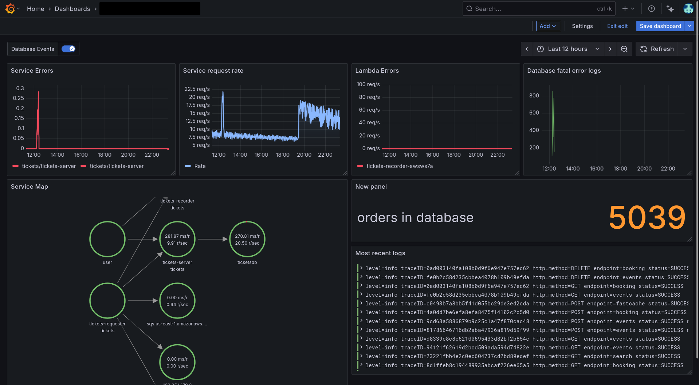

---
---

# 2.2. Building a service health dashboard

In this lab, you will bring together everything that you've learned so far, by creating a custom dashboard in Grafana Cloud.

We will use all of the metrics, logs, and traces that we have collected from our AWS services, and create a dashboard that gives us a comprehensive view of our infrastructure and applications, including:

- Trace metrics from the services

- RDS fatal errors

- SLO burndown alerts, allowing us to correlate events in our infrastructure with SLO breaches

- Tickets purchased in the last hour (via Postgres database)

We'll follow dashboard design best practices, using **RED** metrics (Rate, Errors, Duration) to monitor our services, and adding context from our logs and traces to build an overall picture of the health of our applications.

The dashboard we will create will look something like this:

    

## Step 1: Create a new dashboard

1.  Click on **New -> Dashboard**.

1.  Save your dashboard in a folder with your name, so you can find it later.


## Step 2: Add the Service Map

Let's add the Service Map, since it gives a high-level overview of the services in our application and their relationships.

1.  Since our services are instrumented with OpenTelemetry traces, we can build up a Service Map for our application which will give a nice logical overview. 
    
    Go to **Observability -> Application** and click on the **Service Map** tab.

1.  Click on the **Explore** button in the top right corner of the Service Map.

1.  In the Explore view, click on the **Add to dashboard** button in the top right corner.

1.  Click **Existing dashboard**, find or your new dashboard in the list or use the search box, and click **Open dashboard**.

1.  Once it's been added to your dashboard, click on the context menu in the top right of the panel, choose **Edit** and set the following properties:

    - Panel Title: **Service Map**

1.  Click **Save dashboard** in the top right then click **Back to dashboard**.


## Step 3: Show error rates from traces

1.  Navigate to **Observability -> Application**.

1.  Navigate to **tickets-server** and in the _Errors_ panel, click on the **Explore** button.

1.  In the Explore screen, click on **Add** -> **Add to Dashboard** and follow the same process as above to find your dashboard.

1.  Once it's been added to your dashboard, click on the context menu in the top right of the panel, choose **Edit** and set the following properties:

    - Panel Title: **Service Errors**

1.  Finally, remove the second query from this panel by clicking on its trash icon.

1.  Save and return to the dashboard.

### Show request rate

Repeat the same process as above, but add a panel showing request rate.

1.  Follow the same process but when you get to the **tickets-server** overview in Application Observability, find the _Rate_ panel and click on the **Explore** button.

1.  Add the resulting queries to your dashboard.

1.  Once it's been added to your dashboard, click on the context menu in the top right of the panel, choose **Edit** and set the following properties:

    - Panel Title: **Service Request Rate**
    - Graph styles -> Line width: **2**
    - Graph styles -> Fill opacity: **15**
    - Graph styles -> Gradient mode: **Opacity**
    - Standard options -> Unit: **Throughput -> requests/sec (rps)**
    - Standard options -> Color scheme: **Single color**, then select **Blue**


## Step 4: Add Lambda execution and SQS metrics

Now that we have the Service Map and trace metrics, let's add some Lambda execution metrics to our dashboard.

1.  Navigate to **Cloud Provider -> AWS -> Lambda**.

1.  In the dropdown variables at the top, by **Function name**, select **tickets-recorder-xxxx** where "xxxx" is your workshop's ID (usually contained in your current Grafana URL).

1.  Find the **Errors** panel and click on the **Explore** button in the top right corner.

1.  In the Explore view, click on the **Add to dashboard** button in the top right corner, repeating the same process as above to find your dashboard and then click **Open dashboard**.

1.  Edit the panel, and give it the title **Lambda Errors**. Set the following additional properties:

    - Panel Title: **Lambda Error Rate**
    - Graph styles -> Line width: **2**
    - Graph styles -> Fill opacity: **15**
    - Graph styles -> Gradient mode: **Opacity**
    - Standard options -> Unit: **Throughput -> requests/sec (rps)**
    - Standard options -> Color scheme: **Single color**, then select **Red**

We will also add SQS metrics to our dashboard, since our requester and recorder services are using SQS to communicate with each other.

Let's add the total number of SQS messages. This could give us a clue whether messages are sitting unacknowledged, or whether there is some other issue.

1.  Navigate to **Cloud Provider -> AWS -> SQS**.

1.  Find the **Messages** panel and click on the **Explore** button in the top right corner.

1.  In the Explore view, click on the **Add to dashboard** button in the top right corner.

1.  Edit the panel, and give it the title **SQS Messages**.


## Step 5: Show RDS fatal errors on a graph

In the previous hands-on lab, we saw how a pile-up of errors in our tickets-server service was causing the SLO to breach. We saw that the root cause was that the RDS instance was overloaded with connections, causing the tickets-server-service to be degraded.

To help us monitor this situation and have more visibility in case it happens again in future, we will create a graph that shows the number of fatal errors logged by our RDS instance, over time.

:::tip

In Grafana Loki, you can turn any set of log results into an instant metric. Metric queries let you parse logs and turn them into a time series, helping you to instantly understand what's happening in your logs.

:::

1.  Add a new panel to your dashboard by clicking on the **Add -> Visualization**.

    - Panel type: **Time series**
    - Panel title: **RDS Fatal Error logs**
    - Graph styles -> Line width: **2** (or something of your choice)
    - Standard options -> Unit: **Misc -> Short** - this will show the number of fatal errors in a short format.
    - Standard options -> Color scheme: **Single color**, then select **Red**

1.  In the query box, set the data source to **grafanacloud-xxx-logs** (Loki) and use the following query to count the FATAL errors in the tickets-database:

    ```
    count_over_time({aws_log_group=~"/aws/rds/instance/tickets-database-.*/postgresql"} |= `FATAL` [$__auto])
    ```

1.  Save and return back to the dashboard.

## Step 6: Add SLO event annotations

Annotations are a great way to add context to your dashboards. Annotations mark specific points in time on your graphs, which can help shine a light on events that may have affected your services, or indeed show if problems in your services have affected anything else.

In this case, we'll use annotations to mark when our SLO began to breach, and correlate that with events in our infrastructure.

1.  In your dashboard, click on the **Settings** button.

1.  Click on the **Annotations** tab, then click on **Add annotation query**.

1.  Add the the following details:

    - **Name**: SLO Events
    - **Data source**: Select the `grafanacloud-xxxxx-alert-state-history` (Loki) data source.
    
1.  In the **Query** box, use the query to search for SLO burndown events:

    ```
    {group=~"tickets-server-success-rate.*"} | json
    ```
    
1.  Finally, set the following options:

    - Title: `{{condition}}`
    - Tags: `labels_span_name,labels_service_name`
    - Text: `{{current}}`

1.  Click **Back to list** and then return back to the Dashboard to see the annotations in action.

    You should now see annotations on your dashboard that show when the SLO began to breach, and you can hover over them to see more details.

    :::tip

    If you don't see any annotations, try changing the time range of your dashboard to a wider range, such as the last 7 days. This will ensure that you can see the annotations that were created in the past.

    :::

## Step 7: Add a logs panel

Finally, let's add a logs panel from all of our services, so we can see the latest entries.

1.  Click **Add -> Visualization**.

1.  Choose the **Logs** visualization type.

1.  In the data source query tab, set the data source to **grafanacloud-xxxx-logs** (Loki) and enter this query:

    ```
    {service_name="tickets-server"}
    ```

## Step 8: Add a database records stat

Since we have access to our database instance here, let's also show a stat of the number of orders being held in the bookings database.

1.  Click **Add -> Visualization**.

1.  Choose the **Stat** type.

1.  In the data source query tab, set the data source to **tickets-db** and enter this query:

    ```
    select count(*) from booking;
    ```

1.  Edit the following panel settings:

    - Standard options -> Display name: **orders in database**
    - Standard options -> Color scheme: **single color**, then choose **orange**

## Step 9: Bonus tasks!

The dashboard you have created is a good starting point, but you can customize it further to suit your needs. 

If you're feeling adventurous, you can try some of the following bonus tasks to enhance your dashboard:

- **Rearrange the panels to your liking.** Drag and drop the panels to change their order, and resize them by dragging the edges.

- **Add more panels to show relevant information.** You can also add more panels if you want to show more metrics or logs. For example:

    - add a panel to show RDS CPU utilization, or disk space usage 

    - add a panel to show the number of connections to the RDS instance

    - add a panel to show the number of queries per second

    - add a panel to show number of bookings (in the database) 

- **Create a second dashboard which shows infrastructure metrics.** You can create a second dashboard that shows infrastructure metrics, such as CPU and memory usage, disk space usage, and network traffic. This can help you monitor the health of your infrastructure and identify potential issues. You might like to add:

    - EC2 instance CPU utilization


## Wrapping up

In this lab, you created a custom dashboard in Grafana Cloud that brings together all of the metrics, logs, and traces that we have collected from our AWS services. You learned how to:

- Create a new dashboard and add panels to it

- Use annotations to correlate events in your infrastructure with SLO events, helping you to understand the impact of those events on your services

- Use the Service Map to visualize the relationships between your services and their dependencies

