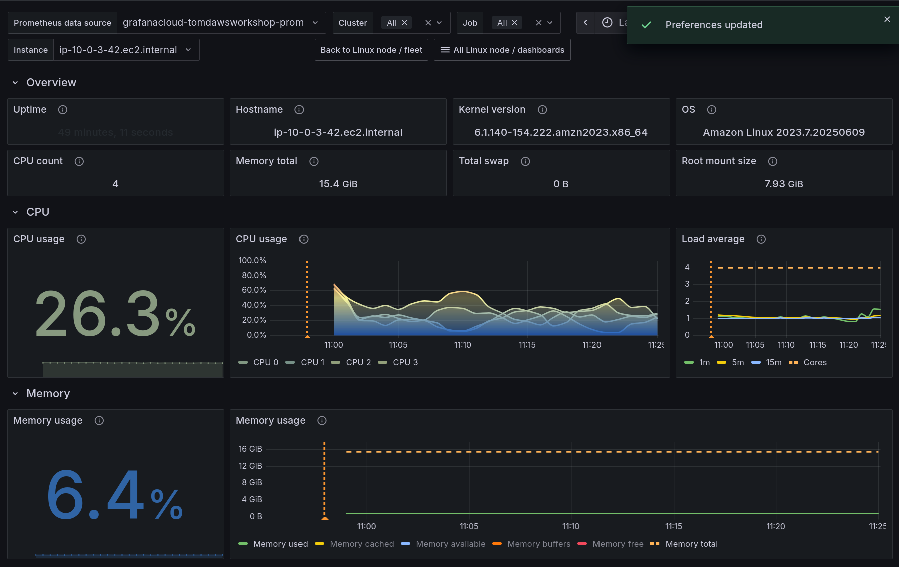
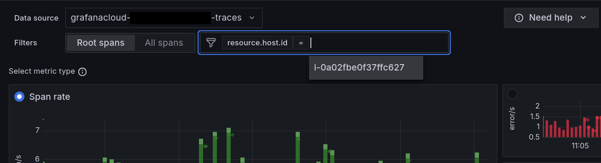
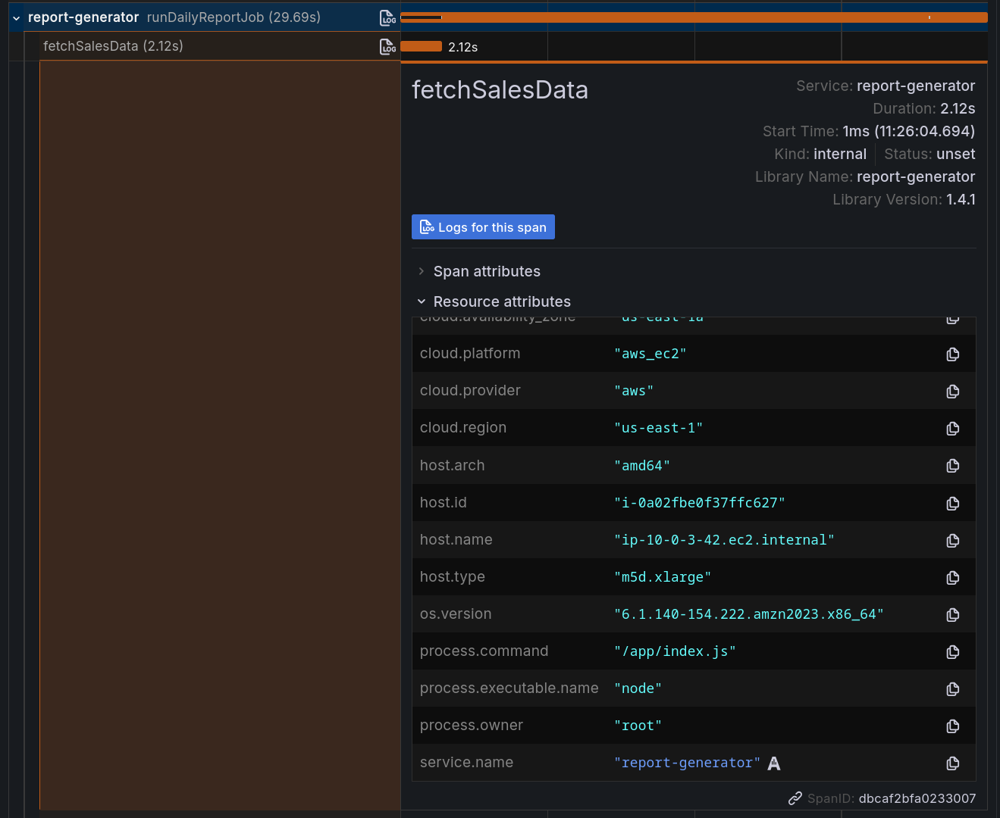

---
---

# 3.1. The Case of the Oversized Instance 🕵️

import Question from '@site/src/components/Question';

Grafana Cloud's AWS integrations help you to understand and optimise your AWS workloads. 

In this lab, you will learn how to analyze costs and resource utilization using Grafana Cloud, and make informed decisions about resizing EC2 instances based on real telemetry data.

## Step 1: Understand your resource utilization

1.  From the side menu, navigate to **Observability -> AWS**. Then, click on the **AWS/Billing** dashboard.

    Notice how we can see the costs associated with our AWS account, including the total cost, and cost by service.

1.  Go back to the AWS Observability home page and click on **AWS/EC2**. Then click on the **Rightsizing** tab to view a dashboard showing instances sorted by:

    - disk write bytes
    - disk read bytes
    - CPU utilization

### Question
**It looks like our EC2 instance might be underutilized.** This could be a good candidate for resizing to a smaller instance type, to save costs.

<Question id={'cost_initialdecision'} title={'Would you resize the EC2 instance based on this stat alone? Why or why not?'}></Question>

## Step 2: Gather node information

Let's gather some more information about the node to make a more informed decision.

1. From the side menu, click on **Dashboards** near the top. Search for the **Linux Node / fleet overview** dashboard.

    Tip: You can also find it by pressing Ctrl+K (or Cmd+K on Mac) to open the search bar, and typing "Linux Node".

    The Linux Node / fleet overview dashboard provides an overview of all nodes in your infrastructure, including CPU and memory usage:

1.  Click on the node that corresponds to your EC2 instance. The dashboard is displayed.

    Through Grafana Cloud's Linux integration, we can see detailed metrics about the node, including CPU and memory usage.

    

### Questions

<Question id={'node_cpumem'} title={'What is the current CPU and memory usage of the node?'}></Question>

<Question id={'node_util'} title={'Is the node underutilized or overutilized, based on the metrics?'}></Question>

<Question id={'node_decision'} title={'Is this information sufficient to make a decision about resizing the EC2 instance?'}></Question>

## Step 3: Analyze the applications running on the node

We decided that we wanted to gather more information before making a decision about resizing the EC2 instance.

Since we're using OpenTelemetry for observability, we can use the data collected from traces, to analyze what is running on the node, without having to log into the node itself.

Using OpenTelemetry we can build up a catalog of services running across our infrastructure, which is helpful not only for troubleshooting and optimizing performance, but also understanding resource utilization.

We will use OpenTelemetry resource attributes to search for traces and metrics coming from this node.

1.  From the side menu, click on **Drilldown -> Traces**.

    This will take you to the Drilldown Traces page, where you can search for traces and metrics across your infrastructure.

1.  Ensure that **Span rate** is selected in the top left corner of the page. This ensures that we're viewing all traces, not just those with errors.

1.  In the filters at the top, in the **Filter by label values** dropdown, select **resource.host.id**. Then select the equals (**=**) operator, then paste the EC2 instance ID you copied earlier, or use the dropdown to select it.

    

    Tip: We use the `resource.host.id` attribute to filter traces by the EC2 instance ID. This is a standard OpenTelemetry _resource attribute_ that is automatically collected by Grafana Alloy agent which is installed on the node.

1.  Now the Drilldown Traces page will show traces that match the EC2 instance ID of your node. This allows you to see all traces and metrics associated with that specific node.

    This is extremely powerful! We have visibility across all applications on our infrastructure, with the ability to slice and dice by any OpenTelemetry resource attribute.

1.  Click on the **Traces** tab to view the traces associated with the node.

    This gives us ultimate visibility into applications running on the node, and their performance.

1.  Finally, click on a trace to view its details. Expand a span and then click on **Resource attributes** to see the OpenTelemetry resource attributes associated with the trace.

    

    This will show you the resource attributes associated with the trace, including **host.type** which tells us the instance type of the EC2 instance, and **cloud.region** which tells us the region where the instance is running.

### Questions

<Question id={'traces_services'} title={'Which service is running on this EC2 instance? What is it doing?'}></Question>

<Question id={'traces_instancetype'} title={'Which OpenTelemetry attribute tells us the machine type of this EC2 instance? Is it large enough for the applications running on it?'}></Question>

## Step 4: Make a decision

Based on the information gathered in the previous steps, we can make a decision about resizing the EC2 instance.

- We saw that Rightsizing dashboard showed that the instance is underutilized, but we wanted to gather more information before making a decision.

- We gathered more information about the node using the Linux Node / fleet overview dashboard, which showed us the CPU and memory usage of the node.

- We analyzed the applications running on the node using OpenTelemetry resource attributes, which showed us the services running on the node and their performance.

<Question id={'cost_decision'} title={'What is your decision about resizing the EC2 instance? What would you do next?'}></Question>

## Wrapping up

In this lab, you learned how to:

- Use Grafana Cloud to analyze costs and resource utilization

- Use OpenTelemetry resource attributes to search for traces and metrics across your infrastructure

- Make informed decisions about resizing EC2 instances based on data

- Understand the importance of cost management in cloud environments

And that brings us to the end of this workshop! Thanks for attending.

To get started with Grafana Cloud and take advantage of all of these features for observing your AWS applications, [sign up for our (actually useful) free forever plan now](https://grafana.com/auth/sign-up/create-user).
