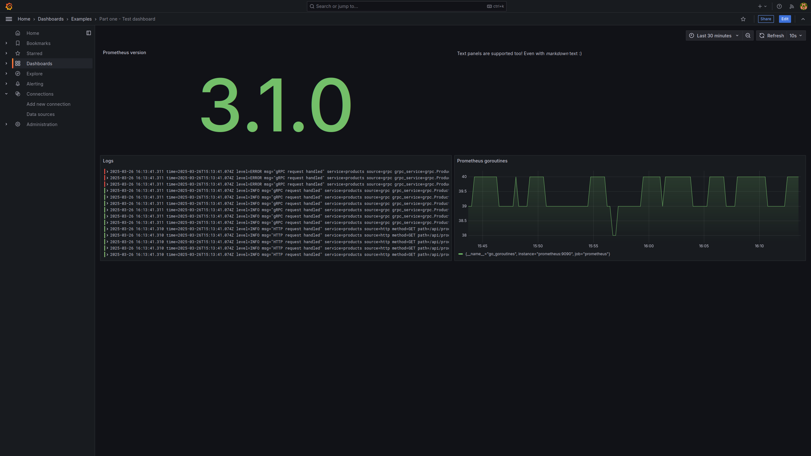

# Part one

To get acquainted with the [Grafana Foundation SDK](https://grafana.github.io/grafana-foundation-sdk/), we will create our first dashboard as code.

Instead of starting from a blank page, we'll use an [existing dashboard](http://localhost:3000/d/part-one-test-dashboard/part-one-test-dashboard)
that showcases a few commonly-used panel types.

## The objective

Using the [Grafana Foundation SDK](https://grafana.github.io/grafana-foundation-sdk/),
convert the existing [sample dashboard](http://localhost:3000/d/part-one-test-dashboard/part-one-test-dashboard) to code.

## What's provided

A skeleton codebase is provided to get you started: `./part-one-[language]-starter`

It contains the boilerplate code needed to write and generate dashboards locally.

> [!TIP]
> Instructions specific to your chosen language can be found in each starter kit
> README.

## Guidelines

As we would do for any other codebase, we'll decompose our dashboard instead
of writing it as a monolithic chunk of code.

As such, each panel present in the dashboard should be defined in its own
function/method.

Similarly, we will define "common functions" for each panel type. For each panel
type (timeseries, logs, …), a function will be responsible for creating a panel
of that type with a set of common options.

The purpose of these "common functions" is double:

* avoid duplicating common options set across panels of a similar types
* ensure a consistent look-and-feel for panels of a similar types

In this lab, we will focus on the following panel types and configure their
*common* options as follows:

> * `logs` panels
>   * `showTime` set to `true`
>   * `sortOrder` set to `Descending`
>   * `enableLogDetails` set to `true`
> * `stat` panels
>   * no specific options
> * `text` panels
>   * `mode` set to `markdown`
> * `timeseries` panels
>   * `fillOpacity` set to `20`
>   * `gradientMode` set to  `opacity`
>   * `legend` options:
>     * `displayMode` set to `list`
>     * `placement` set to `bottom`
>     * `showLegend` set to `true`

The panels in the [example dashboard](http://localhost:3000/d/part-one-test-dashboard/part-one-test-dashboard)
are configured as follows:

> * stat panel
>   * `title`: `Prometheus version`
>   * `transparent` set to `true`
>   * `reduce` options
>     * `calcs` set to `["last"]`
>     * `fields` set to `/^version$/`
>   * Instant Prometheus query: `prometheus_build_info{}`
>   * `datasource`: Prometheus datasource ref
> * text panel
>   * `content`: `Text panels are supported too! Even with *markdown* text :)`
>   * `transparent` set to `true`
> * logs panel
>   * `title`: `Logs`
>   * Loki query: `{job="app_logs"}`
>   * `datasource`: loki datasource ref
> * timeseries panel
>   * `title`: `Prometheus goroutines`
>   * Prometheus query: `go_goroutines{job="prometheus"}`
>   * `datasource`: prometheus datasource ref

Recommendations:

* Start by getting acquainted with the codebase in `./part-one-[language]-starter`
* Focus on one panel at a time
* Use the [example dashboard](http://localhost:3000/d/part-one-test-dashboard/part-one-test-dashboard)
  to explore each panel's options and find their equivalent in the [Foundation
  SDK reference](https://grafana.github.io/grafana-foundation-sdk/v11.4.x+cog-v0.0.x/go/Reference/)
* Preview your changes locally as often as you want, deploy when you're ready

> [!TIP]
> Make sure you go through the instructions found in each starter kit
> `README.md` file.

## Deploying

Instructions on deploying the dashboard are included in each skeleton's README.

## Next steps

[Part two](./part-two.md)
