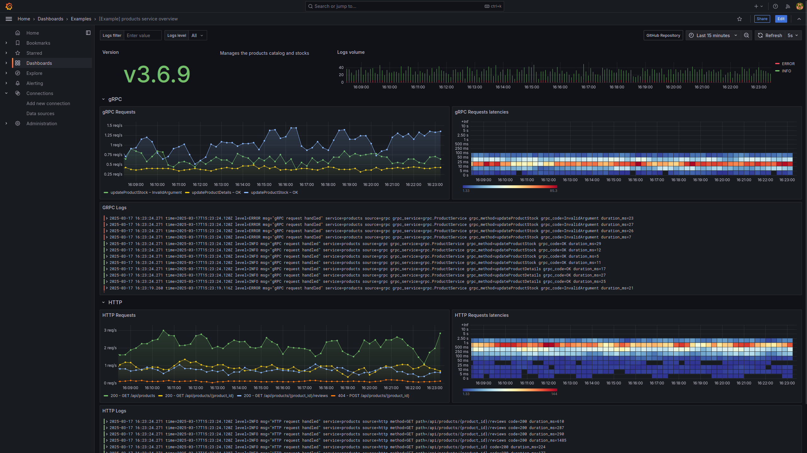

# Part two

We are members of the SRE team in a company that operates an e-commerce platform.

Dozens of microservices are deployed within the platform, and dashboards are
either missing or very inconsistent from one service to the next.

Luckily, most of the services are based on the same framework and expose similar
metrics.
A service catalog also exists, containing an exhaustive list of all services in
the platform and their characteristics.

## The objective

Using the [Grafana Foundation SDK](https://grafana.github.io/grafana-foundation-sdk/),
write a default/standard dashboard for every service in the platform.

> [!NOTE]
> Not all services have the same characteristics. Some have an HTTP API, some
> have a gRPC one, and some have both.
> The dashboards will have to be generated accordingly.

The desired generated dashboards will be based on the following example:



## What's provided

A skeleton codebase is provided to get you started: `./part-two-[language]-starter`

It contains the boilerplate code needed to write and test dashboards locally,
as well as the code used to call the service catalog and generate dashboards for
each service.

Instructions specific to your chosen language can be found in each skeleton's
README.

> [!NOTE]
> A fake service catalog is included as part of the Docker Compose stack.
> It can be reached via:
>
> ```shell
> curl http://localhost:8082/api/services
> ```

A [live example of the desired dashboard](
http://localhost:3000/d/example-products-overview/part-two-products-service-overview)
is provisioned in Grafana. It monitors a `products` service that is part of the fake services running via
Docker Compose.

This dashboard can be used as interactive source to explore and reproduce as code.
Alternatively, a complete dashboard and panel breakdown can be found below.

> [!TIP]
> <details>
> <summary>⤵️ <b>See dashboard breakdown</b></summary>
>
> * `Version` panel
>   * type: `stat`
>   * query: `app_infos{service="[service_name]"}`
>	   * instant: `true`
>   * datasource: Prometheus datasource
>   * transparent: `true`
>   * reduce options:
>     * values: `false`
>     * calcs: `["last"]`
>     * fields: `/^version$/`
>   * height: 4
>   * span: 4
> * service description panel
>   * type: `text`
>   * transparent: `true`
>   * height: 4
>   * span: 4
> * `Logs volume` panel
>   * type: `timeseries`
>   * query: `sum by (level) (count_over_time({service="[service_name]", level=~"$logs_level"} |~ "$logs_filter" [$__auto]))`
>     * legend format: `{{ level }}`
>   * stacking mode: `normal`
>   * `legend` options:
>     * displayMode: `list`
>     * placement: `bottom`
>     * showLegend: `true`
>   * draw style: `bars`
>   * override by name:
>     * name: `INFO`
>     * value: `color = {"mode": "fixed", "fixedColor": "green"}`
>   * override by name:
>     * name: `ERROR`
>     * value: `color = {"mode": "fixed", "fixedColor": "red"}`
>   * height: 4
>   * span: 16
> * `gRPC` row
>   * `gRPC Requests` panel
>     * type: `timeseries`
>     * query: `rate(grpc_server_handled_total{service="[service_name]"}[$__rate_interval])`
>     * datasource: Prometheus datasource
>     * query legend format: `{{ grpc_method }} – {{ grpc_code }}`
>     * unit: `requests per second` (reqps)
>     * height: 8
>     * span: 12
>   * `gRPC Requests latencies` panel
>     * type: `heatmap`
>     * query: `sum(increase(grpc_server_handling_seconds_bucket{service="[service_name]"}[$__rate_interval])) by (le)`
>     * query format: `heatmap`
>     * datasource: Prometheus datasource
>     * height: 8
>     * span: 12
>   * `gRPC Logs` panel
>     * type: `logs`
>     * query: `{service="[service_name]", source="grpc", level=~"$logs_level"} |~ "$logs_filter"`
>     * height: 8
>     * span: 24
> * `HTTP` row
>   * `HTTP Requests` panel
>     * type: `timeseries`
>     * query: `rate(http_requests_total{service="[service_name]"}[$__rate_interval])`
>     * datasource: Prometheus datasource
>     * query legend format: `{{code}} - {{ method }} {{ path }}`
>     * unit: `requests per second` (reqps)
>     * height: 8
>     * span: 12
>   * `HTTP Requests latencies` panel
>     * type: `heatmap`
>     * query: `sum(increase(http_requests_duration_seconds_bucket{service="[service_name]"}[$__rate_interval])) by (le)`
>     * query format: `heatmap`
>     * datasource: Prometheus datasource
>     * height: 8
>     * span: 12
>   * `HTTP Logs` panel
>     * type: `logs`
>     * query: `{service="[service_name]", source="http", level=~"$logs_level"} |~ "$logs_filter"`
>     * height: 8
>     * span: 24
>
> </details>

Each service described in the service catalog produces dummy metrics and logs
that can be queried from Grafana.

## Writing a generic dashboard

Recommendations:

* Start by getting acquainted with the codebase in `./part-two-[language]-starter`
* Re-use the *common functions* defined in part one
* Focus on one panel at a time
* Use the [example dashboard](http://localhost:3000/d/example-products-overview/example-products-service-overview)
  to explore each panel's options and find their equivalent in the [Foundation
  SDK reference](https://grafana.github.io/grafana-foundation-sdk/v11.4.x+cog-v0.0.x/go/Reference/)
* Preview your changes locally as often as you want, deploy when you're ready
* Describe each panel in its own function

> [!TIP]
> Make sure you go through the instructions found in each starter kit
> `README.md` file.

## Deploying

Instructions on deploying the dashboards are included in each skeleton's README.

## Next steps

[Going further](./going-further.md)
