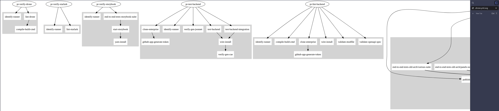

# drone-graph

Create graphics of your Drone build pipelines to better grasp what's happening in the output of your complex build setups.

## Dependencies

You should likely set up a venv for this (e.g. `uv venv .venv`) before running anything. Remember to source the venv.

To install this into the venv, run `uv pip install .`. This adds `drone-graph` to the PATH.
You can even use the installed script on your own `PATH`, e.g.: `ln -s ~/work/drone-graph/.venv/bin/drone-graph ~/.local/bin/`. It'll use the venv's python installation & dependencies to run.

The output should look something like this:

