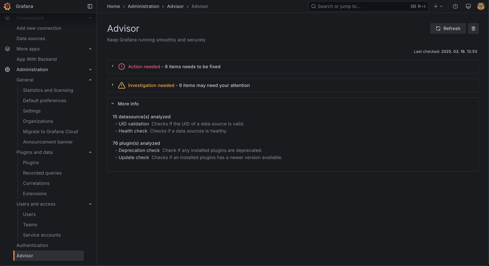

# grafana-advisor-app

An app for visualising checks that require immediate action or investigation.



## Development

Follow these steps once you have pulled the repo:

#### 1. Install dependencies

```bash
npm install
```

#### 2. Build the UI

```bash
npm run build

# Alternatively watch for changes in a separate bash session
# npm run dev
```

#### 3. Run with docker (Grafana `main`)

```bash
npm run server
```

#### 4. Visit in the browser

[http://localhost:3000/a/grafana-advisor-app](http://localhost:3000/a/grafana-advisor-app)

#### 5. Run checks

Click on the "Refresh" button in case you don't see anything, and refresh the page after a few seconds.

(Clicking the button initiates the checks, but it "doesn't wait" for them to finish, that can take some time.)

---

### Run in `grafana/grafana`

Running the plugin in `grafana/grafana` can make development easier, since the dev build of the grafana repo has a lot of plugins and datasources provisioned that we can test against.

#### 1. Build the plugin

This will produce a dist/ directory under the plugin.

```bash
npm run build
```

#### 2. Link to grafana/grafana

We want to create a symbolic link in grafana/grafana that points to our plugins dist/ folder, so any time we change the plugins frontend it gets reflected.

```bash
# PATH_TO_YOUR_PLUGIN: path to the local copy of grafana-advisor-app, e.g. "/Users/leventebalogh/grafana-advisor-app"<br>
# PATH_TO_GRAFANA: path to the local copy of grafana/grafana, e.g. "/Users/leventebalogh/grafana"
ln -s <PATH_TO_YOUR_PLUGIN>/dist/ <PATH_TO_LOCAL_GRAFANA>/data/plugins/grafana-advisor-app
```

#### 3. Run Grafana locally

(Run this from the root of your local grafana/grafana.)

```bash
make run
```
