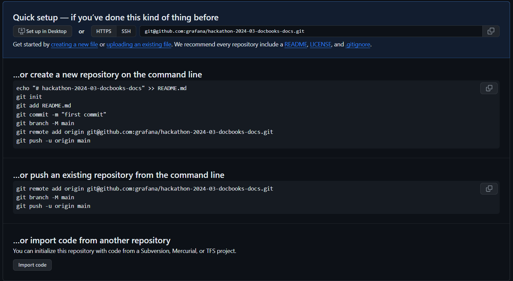

## Local Environment Setup for Yarn Project in IntelliJ IDEA 

### Prerequisites

1. IntelliJ IDEA 2023.3.4, Ultimate Edition
2. Node.js installed on your computer
3. Yarn package manager installed on your computer

### Steps

1. **Open IntelliJ IDEA**
2. **Create a new project** by going to `File > New > Project`. Alternatively, **open an existing project**.
3. **Open Terminal** in IntelliJ IDEA. You can do this by going to `View > Tool Windows > Terminal`.
4. **Navigate to your project directory** using `cd PATH_TO_PROJECT_DIRECTORY`.
5. **Initialize the Yarn project** by typing and running `yarn init`. This will create a `package.json` file in your project directory.
6. **Add dependencies** if you need any specific libraries for your project. You can do this by running `yarn add PACKAGE_NAME`.
7. **Write your code** in the appropriate files in your project.
8. **Run your project** using `yarn run SCRIPT_NAME` (SCRIPT_NAME can be "start" if you want to start your project).

Remember to regularly use `yarn install` to manage any new dependencies you added. 

Now, your local environment setup for the Yarn project in IntelliJ IDEA 2023.3.4, Ultimate Edition is ready.

### Checkout this image
