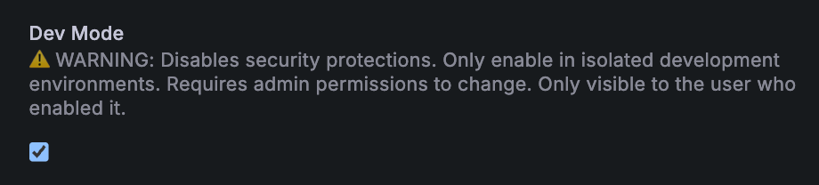
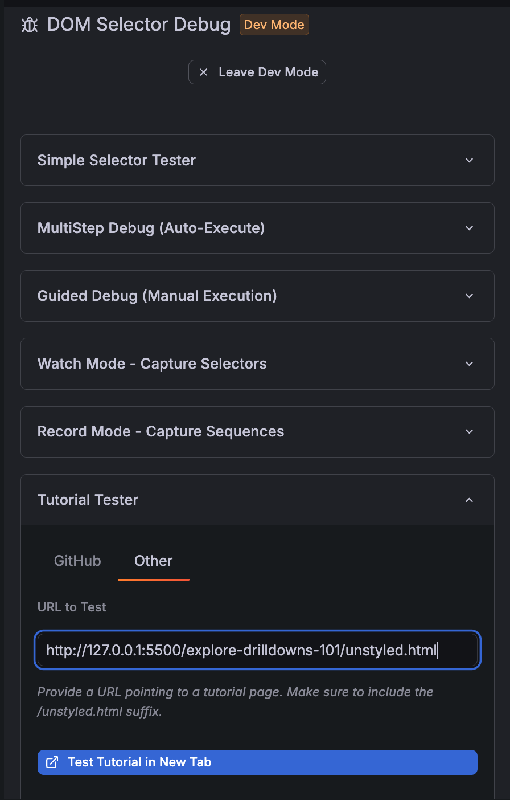
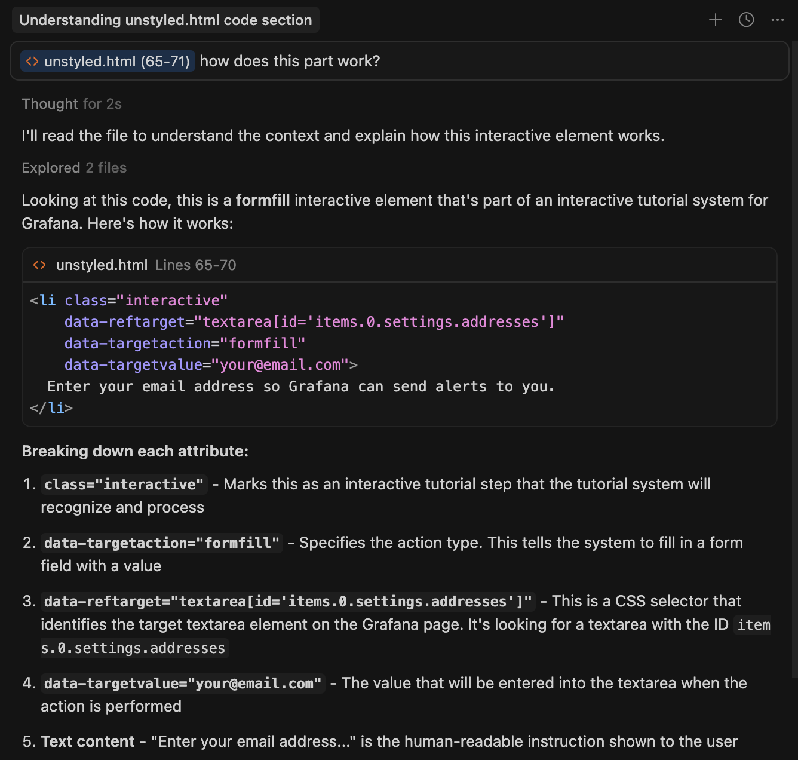

# Interactive Learning Tutorials

This repository contains interactive learning tutorials for Grafana, designed by
Developer Advocacy. It is designed to work with Cursor's AI assistant.

## First: Understand What We're Building!

0. Go to [Drilldown section of Grafana Play](https://play.grafana.org/drilldown)
1. Click the `?` help icon in the upper right hand corner of the screen, to open the interactive learning plugin

2. Make sure you're on the Drilldown page, check the Recommendations tab.
3. Follow the _Interactive Tutorial: Explore Drilldowns 101_ by clicking the "View" button by that recommendation. We're going to build
an interactive tutorial like that!
4. Notice the structure: it's built in sections, of individual steps, with each step having a "Show Me" and "Do It" option.

## Quick Start: Let's Build a new Interactive Guide

**[This video is a complete 10-minute guide to the development process for guides](https://www.youtube.com/watch?v=zMXf1enyPN0)**.  The instructions below will recap the key parts.

### Set up the Interactive Learning Plugin Locally

* **Make sure you have Cursor** (it's worth it). [Download it](https://cursor.com/downloads).
* Clone this repo to your machine.  Also clone the [interactive learning plugin](https://github.com/grafana/grafana-pathfinder-app)
* Start the plugin repo.  [full instructions are here](https://github.com/grafana/grafana-pathfinder-app/blob/main/docs/developer/LOCAL_DEV.md) but the short version is: `npm install` then `npm run build && npm run server` and go to http://localhost:3000/
* Once you've logged into your running version of Grafana, go to the Interactive Learning Plugin settings page, and set the
end of the URL to include `?dev=true`. The full URL should be roughly `{instance}/plugins/grafana-pathfinder-app?dev=true`
* **Click the `?` help icon** (as shown earlier in step 1) to open the sidebar where you'll find the dev mode settings:

* **The checkbox will not appear unless `dev=true` is in the URL**. Select that and save plugin settings

### Create a Draft HTML Guide

Interactive guides are just HTML documents, with a few extra special attributes that tell the plugin how
to interact.  So writing a guide is just making an HTML file. There are a lot of examples in this repo; see 
any `unstyled.html` file in one of the sub-directories.

#### Option 1: Start from Scratch

In cursor, use Agent mode and just type in `/new My First Guide`.  This will create a directory and an HTML
file for you in the right format, which you can just go edit.

#### Option 2: Start from Existing Instructions

You can use [the importer app](https://pathfinder-importer.vercel.app/) to upload 
a file you may have already written. This tool uses AI to help you reformat your doc into a basic
HTML interactive guide. 

In the "Enhance" tab there is a function called "Content Advisor" that can give basic 
feedback about whether your doc is a good candidate for an interactive guide. In general we're looking for clear step-by-step
instructions.

### Iterate & Develop

As you build your guide, you'll want to see it in the plugin, and test to make sure it works.

We recommend hosting your local HTML file on a local server; we use the [Live Server extension](https://marketplace.cursorapi.com/items/?itemName=ritwickdey.LiveServer) in Cursor to do this. Install this extension, click "Go Live" in the extreme bottom right of Cursor, and
local files will be hosted on http://localhost:5000 or different port.

You can then use the Tutorial tester to iterate. Simply put the URL to your `unstyled.html` draft guide into the box.

**NOTE**: The tutorial tester will not appear unless you are in dev mode.

If you don't have the Live Server extension or don't want to host the file locally, you can push to a branch of this
repo, and use Tutorial Tester >> Github to load from Github. We like Live server because it's faster and lets us iterate
without `git push`.

### DOM Selectors

Writing interactive guides usually boils down to writing lists of steps and their accompanying text, which is 
straightforward. We draw your attention to the `data-reftarget` attributes in the HTML, which contain DOM selectors.
**These are absolutely critical to get right**, because they tell the plugin which buttons, input boxes, etc. are being
targeted by the interactive features.

### Interactive Action Types: Asking Cursor for Help

What kinds of interactive steps can you make?  See [docs/interactive-types.md] for a full list, or 
just ask Cursor.  A good way to get started is to read one of the existing guides, highlight bits and
add it to the model context, and ask cursor "How does this part work?"

Cursor knows quite a lot about what's in this repo!  Use `Ask` mode and ask it 
questions about how different interactive elements work. Cursor will use the `docs` 
folder in this repo to answer your questions.

Here's an example of Cursor in Ask mode, explaining a feature:

## Ask Us Questions!

* Talk to Tom Glenn, David Allen, or Simon Prickett, all of whom have done this before. They will help.
* They can be reached by email (if they have shared with you) or internal on Grafana's slack in `#proj-grafana-pathfinder`

## Getting Your Tutorial Into The Plugin

Once you're finished with a draft, we need to add it to the recommender. This will 
ensure that the right users get the content recommended to them when using Grafana.

1. Open a PR to this repo with your new guide! Ping Jay Clifford, Tom Glenn, or
David Allen to get it merged.
2. We'll wire it into the recommender for you.
3. MAKE SURE TO INCLUDE IN YOUR PR:  When should users see your guide? What are they looking at in the UI when it appears as a recommendation? Who should see your guide? Admins only?  Commercial stacks?  Free stacks? "Everybody" is an acceptable answer.  This determines how it will appear.

## Full Reference Documentation

For complete AI reference documentation, see `.cursor/README.mdc`.  This contains
a full reference guide to all of the things that can be done, and how to use them.
