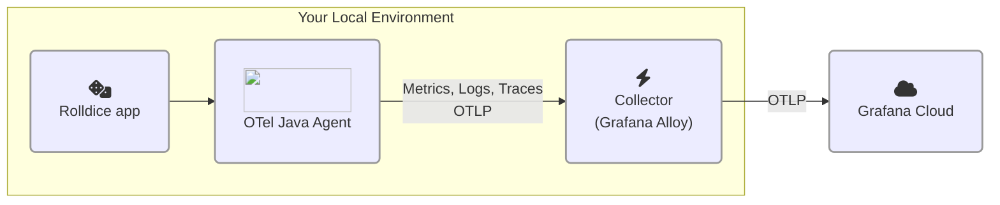

# 1.3. Zero-code OpenTelemetry

In this lab we'll look at how to add zero-code instrumentation to an application.

After you've finished this step, your architecture will look like this:




## What is zero-code instrumentation?

From the OpenTelemetry documentation:

> Zero-code instrumentation adds the OpenTelemetry API and SDK capabilities to your application **typically as an agent or agent-like installation**. The specific mechanisms involved may differ by language, ranging from bytecode manipulation, monkey patching, or eBPF to inject calls to the OpenTelemetry API and SDK into your application.

> Typically, **zero-code instrumentation adds instrumentation for the libraries you’re using.** This means that requests and responses, database calls, message queue calls, and so forth are what are instrumented. Your application’s code, however, is not typically instrumented. To instrument your code, you’ll need to use code-based instrumentation.

:::opentelemetry-tip[Should I use zero-code instrumentation, or manual instrumentation?]

When you're adding OpenTelemetry to your own applications, you should start with auto, or zero-code instrumentation where possible. Zero-code instrumentation is designed to instrument common libraries and frameworks in your programming language automatically. Later, you can augment this with manual instrumentation, if you need to capture additional telemetry from your own code.

:::


## Step 1: Configure and run the instrumented application

In this step, we'll configure our application to ship OpenTelemetry signals directly to Grafana Cloud's OTLP endpoint.

Complete the following steps:

1.  Open your virtual development environment.

1.  From the project Explorer pane, expand the project tree and **open the file** `persisted/rolldice/run.sh`.

    :::tip
    
    If you don't see this file, make sure that you followed the step "Run the demo app" from the first lab, as it includes some essential setup steps.

    :::

1.  Think of a unique namespace for your service. We'll use the OpenTelemetry attribute `service.namespace` to distinguish your applications from your fellow participants in this workshop.

    You might use something like: `johnd` or `cthulhu`.

    Remember the name you choose, because you'll use the same name in Lab 2.

1.  Now configure the run script for the _rolldice_ application, to add the OpenTelemetry Java agent.

    In the file `run.sh`, **just before** the final line (`java -jar ...`), insert these lines, replacing `<your chosen namespace>` with your chosen namespace:

    ```shell
    export NAMESPACE="<your chosen namespace>"
    export OTEL_RESOURCE_ATTRIBUTES="service.name=rolldice,deployment.environment=lab,service.namespace=${NAMESPACE},service.version=1.0-demo,service.instance.id=${HOSTNAME}:8080"
    export OTEL_EXPORTER_OTLP_PROTOCOL="grpc"
    export OTEL_EXPORTER_OTLP_ENDPOINT="http://localhost:4317"
    ```

    :::warning

    Make sure that you have replaced `<your chosen namespace>` with the name you have chosen, e.g.:

    `export NAMESPACE="fred"`

    :::

    What's happening here? We are configuring the OpenTelemetry Java agent to attach these OpenTelemetry _resource attributes_ to our signals:

    | Resource attribute name | Value | Description |
    | ------------------ | ----- | ---- |
    | service.name | rolldice | This holds the the canonical name of our application |
    | deployment.environment | lab | The environment where the app is running. We've chosen "lab" here, but in the real world you might use something like "production", "test" or "development". |
    | service.instance.id | (your IDE's hostname) | The value of this attribute uniquely identifies your instance, which is useful if there are many instances of the app running. We use the **hostname** which, in this lab environment, is unique, and persists for the lifetime of your IDE session. |
    | service.namespace | (your choice of name) | This allows us to distinguish your set of application(s) from the others in the same **environment**. So, when you have several applications running, you will be able to group them together more easily. |

    :::opentelemetry-tip

    OpenTelemetry components often use **environment variables** for configuration. The default value for  `OTEL_EXPORTER_OTLP_ENDPOINT` assumes that you want to send telemetry to an OpenTelemetry collector on `localhost`. We could omit this environment variable entirely, but we're including it explicitly here, to make it clear what's happening. 
    
    In production, you might set this value to `http://alloy.mycompany.com:4317`, or wherever your Alloy instance is located.

    :::

1.  While still in the file `run.sh`, **edit the final line** to attach the [OpenTelemetry Java agent](https://opentelemetry.io/docs/zero-code/java/agent/):

    ```shell
    java -javaagent:opentelemetry-javaagent.jar -jar ./target/rolldice-0.0.1-SNAPSHOT.jar  
    ```

    If you're not familiar with Java, the `-javaagent:` argument tells the Java process to attach an agent when the program starts. Agents are other Java programs which can interact and inspect the program that's running.

1.  Now, start the application again by opening a new terminal (**Terminal -> New Terminal**) and typing:

    ```shell
    cd persisted/rolldice

    ./run.sh
    ```

    :::tip

    If you are running through this workshop on a small screen, you might find it easier to "pop out" the terminal windows, so that they are in a new browser window and so you have more space. 

    To do this, click the _Move View to Secondary Window_ icon at the top right of the terminal.

    :::

1.  Finally, open another new terminal (**Terminal -> New Terminal**), and generate some traffic to the service by running a k6 load test:

    ```shell
    cd persisted/rolldice 

    k6 run loadtest.js
    ```

    The load test will start and run for an hour. Let's leave the script running.

    You can watch the progress of the load test in the console:

    ```
    running (0h26m56.8s), 2/2 VUs, 647 complete and 0 interrupted iterations
    default   [================>---------------------] 2 VUs  0h26m56.8s/1h0m0s
    ```

    :::info

    [k6](https://k6.io/) is a load testing tool from Grafana that makes it super-easy to simulate traffic to your services. We've created a k6 script (`loadtest.js`) which tests the _rolldice_ service automatically, so you can save your wrists.

    :::

## Step 2: Smoke test: find a Trace

We've configured zero-code OpenTelemetry instrumentation for our application, and we are collecting signals with a collector (Grafana Alloy).

Now let's check that everything is working by performing a quick "smoke test". Let's find a trace in Grafana Cloud:

1.  Go to your Grafana Cloud instance.

1.  From the main menu, go to **Explore**.

1.  Select the `grafanacloud-xxxxx-traces` (Tempo) data source.

1.  By **Query type**, click **Search**. Then, add these filters:

    - In the **Service Name** dropdown, select **rolldice**.

    - In the **Tags** section, change **span** to **resource**. Select the **service.namespace** tag, and then enter the value **(your chosen namespace)**.

    Click **Run query**.

1.  You should see OpenTelemetry traces from _rolldice_ in Grafana Cloud Traces! Each of the traces shown represents a request that was generated by our k6 load test script.

You can explore more into the trace, if you're feeling curious! In the next section of the workshop, we will explain this screen, and how to observe more signals.

## Wrapping up

In this lab, you've learned how to do the following:

- Instrument an app without writing a line of code, using the OpenTelemetry agent for Java. [Read the Grafana Cloud docs here on how to instrument a JVM application in your own environment](https://grafana.com/docs/grafana-cloud/monitor-applications/application-observability/instrument/jvm/).

- Automatically collect traces from the application, using the OpenTelemetry Java agent.

- Ship signals as OTLP (OpenTelemetry's protocol for sending telemetry) to Grafana Cloud

- View OpenTelemetry traces from an application using Grafana Explore.

Click Next to continue to the quiz for this lab.
