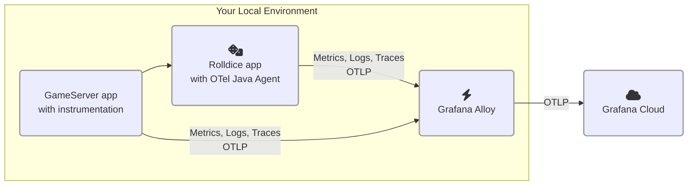

# 2.2. Add a second service 

In this lab, you'll add a second service to the architecture, with OpenTelemetry instrumentation.

After you complete this module, your environment will look like this:




## Step 1: Run a Go program with OpenTelemetry instrumentation

Some languages require you to add OpenTelemetry libraries or code into your application. Go is one example of a language that uses this approach.

In this part of the workshop, we will run a Go program which is instrumented with OpenTelemetry libraries. To save time, we've already added the instrumentation code for you.

This service is called _gameserver_. It runs a simple game, where a user competes with the Computer to get the highest score. The _gameserver_ service calls the _rolldice_ service (from Lab 1) to obtain two random rolls of the dice. The winner of each game is the player with the highest score.

(Keen observers may spot there's something missing in these requirements. You'll find out what it is, shortly!)

Let's run the _gameserver_:

1.  Open your virtual development environment.

1.  Firstly, stop the _rolldice_ k6 test if it is still running: find the terminal running the k6 script, and press **Ctrl+C** to abort the test, then **close the terminal**.

1.  Open a new terminal (**Terminal -> New Terminal**), and type the following to copy the second project into your persistent workspace, then enter the new directory:

    ```
    cp -r /opt/gameserver /home/project/persisted/

    cd /home/project/persisted/gameserver
    ```

1.  In the project Explorer tree, find the file `persisted/gameserver/otel.go` and open it, to inspect the code.

    :::tip

    If you plan to instrument your own Go application, you can follow [a step-by-step guide in the Grafana Cloud documentation][1].

    :::

    Inside `otel.go` is some _boilerplate code_ to initialize the OpenTelemetry SDK and add auto-instrumentation of packages. It sets up traces, logs and metrics exporters.

    Like the other OpenTelemetry language SDKs, it can be configured with environment variables, which we will do next.

1.  Let's set our OpenTelemetry _resource attributes_ for this application.

    Open the run script, `persisted/gameserver/run.sh`. **Just before** the final line (`go run .`), insert these lines, replacing `<your chosen namespace>` with the same namespace you chose in the previous lab:

    ```shell
    export NAMESPACE="<your chosen namespace>" 
    export OTEL_RESOURCE_ATTRIBUTES="service.name=gameserver,deployment.environment=lab,service.namespace=${NAMESPACE},service.version=1.0-demo,service.instance.id=${HOSTNAME}:8090"
    ```

1.  In an unused terminal, change to the `persisted/gameserver` directory and run _gameserver_. It might take a minute or two to start, as your code will need to be compiled:

    ```
    cd /home/project/persisted/gameserver

    ./run.sh
    ```

    :::warning[Rolldice should still be running]

    Make sure the _rolldice_ application is still running before running the next command, because the _gameserver_ app depends on it. If the _rolldice_ service has stopped, refer back to the previous Lab to see how to run it.

    :::


1.  Finally, let's generate some load to the service.

    :::tip

    Ensure you have stopped the _rolldice_ k6 load test from Lab 1 before continuing. To stop the load test, find the terminal where k6 is running, and press **Ctrl+C**.

    :::

    In a new terminal, run the following commands:

    ```
    cd /home/project/persisted/gameserver

    k6 run loadtest.js
    ```

    You should see some requests arriving into _rolldice_. k6 is sending test requests to _gameserver_, which is calling _rolldice_ to get random numbers.

By the end of this step, you should be running the complete system:

- An OpenTelemetry collector (Grafana Alloy) 

- The _rolldice_ application (Java)

- The _gameserver_ application (Go)

- The _gameserver_ load test script (k6)

## Step 2: Explore the Service Map and Overview

Now that we've instrumented a second service, we will be able to visualize the interaction between these services in a Service Map.

1.  In Grafana, navigate to Application Observability (from the side menu, click **Application**).

1.  Using the filters, narrow down the service inventory to:

    - environment = lab

    - service.namespace = (your chosen namespace)

1.  Click on the **Service Map** tab.

    You'll now see a visualization of all services that match the given filters, and their metrics. This Service Map is generated from span metrics. 

    :::tip

    If you can't see both services in the service inventory list, wait a few moments for span metrics to be generated. Then, click the Refresh button.

    :::
    
    In the map, notice how you can see the flow of interaction between _gameserver_ and _rolldice_. You can also see the number of requests per second to the service:

    

1.  Click on the **gameserver** circle in the map, then click on **Service Overview**.

    Now we can see the health of this service. In the _Downstream_ panel, notice how Grafana has identified the downstream service (_rolldice_ from Lab 1).

    

You'll notice that our service seems to be throwing some errors. We'll look at those next.


## Step 3: Diagnose an error

Let's zoom in on these errors that our service seems to be experiencing.

:::opentelemetry-tip

OpenTelemetry auto-instrumentation can mark traces with a status of **error** when it detects that an error is being returned by the service. That makes it a lot easier to identify failed requests to our services. In Grafana Cloud, we can easily correlate to find out the root cause.

:::

1.  From the Service Overview screen for _gameserver_, find the **Errors** graph, and click on the **Traces** button to show errored traces.

    Application Observability navigates to the _Traces_ tab and lists traces which were marked with a `status` of `error`, in the selected time frame.

    

    Notice how the Traces tab has generated the following TraceQL query, to find all errored traces:

    ```
    {resource.service.name="gameserver" 
        && resource.deployment.environment=~"lab" 
        && resource.service.namespace="<NAMESPACE>" 
        && status=error}
    ```

    :::opentelemetry-tip

    Did you notice the OpenTelemetry attributes within this TraceQL query? In this query, we're referencing _resource attributes_, by adding the `resource.` prefix to the attribute names.
    
    For example: `resource.service.namespace`, and `resource.service.name`.
    
    :::

1.  Find a trace and **click on the trace ID** to open the Trace view. Now we're beginning to see some interesting traces!

    The _gameserver_ application makes two calls to _rolldice_ to fetch a random number, so it can calculate a result for the game.

    The trace visualizes the two calls to the _rolldice_ service in a different color:

    

1.  We viewed this trace because it had an error. Let's find out the root cause.

    Click on one of the errored span names to expand the trace. Can you find out why the service errored?

    You can also click **Logs for this span** to view logs, if you want to see the relevant logs around this span.

    **Question: Why do you think this service is throwing an error?** You can check your hypothesis in the quiz at the end of this lab.

1.  Once you've diagnosed the error, can you use the trace information to find out the answer to this question:

    - Which OpenTelemetry instrumentation libraries (name and version) were used to create these traces?

        <details>
        <summary>See how to find the answer</summary>

        Look at the **text in the header of each span**. It should have a _Library Name_ and _Library Version_ field. e.g.:

        - go.opentelemetry.io/contrib/instrumentation/net/http/otelhttp (for Go's HTTP capabilities)
        - io.opentelemetry.tomcat-10.0 (for Java's Tomcat webserver)
        </details>

:::opentelemetry-tip

OpenTelemetry's _instrumentation libraries_ lay the groundwork for telemetry. They do things like generating spans and metrics from the everyday libraries and frameworks that you use in your app.

Instrumentation libraries are available for many different frameworks and packages, such as Go's native `http` package.

:::


## Wrapping up

In this module you learned how to:

- See what some typical OpenTelemetry SDK boilerplate code looks like

- Visualize a Service Map of your OpenTelemetry tracing instrumented services 

- Navigate to errored traces, and correlate to logs to find a root cause

Most importantly, we didn't need to add extra configuration to our collector. Grafana Alloy received OTLP signals from our services, and forwarded them automatically to Grafana Cloud.

Click the next module to continue.

[1]: https://grafana.com/docs/grafana-cloud/monitor-applications/application-observability/instrument/go/
