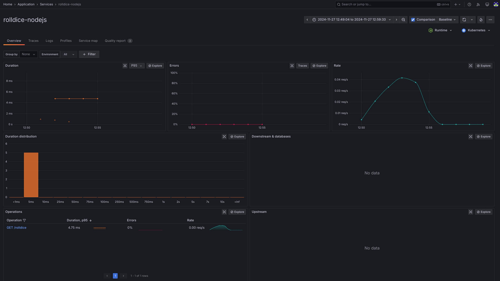

OTEL Operator Demo
-----------------------

A playground for OTEL operator, pre-configured to work with [Grafana Cloud](https://grafana.com/products/cloud/) and [Application Observability](https://grafana.com/products/cloud/application-observability/).

It includes:

- A set of containerized, un-instrumented applications using different supported languages.
- Manifests to deploy OpenTelemetry operator, configured to instrument the applications.

## Requirements

- kind
- kubectl
- docker

## Instructions - OpenTelemetry Operator

Create a new kind cluster:

```bash
make setup-cluster
```

Setup cert manager:

```bash
make setup-cert-manager
```

Set OTLP credentials. Edit 'manifests/collector.yaml' and set the desired values for the following environment variables:

- `GRAFANA_CLOUD_OTLP_ENDPOINT`
- `GRAFANA_CLOUD_INSTANCE_ID`
- `GRAFANA_CLOUD_API_KEY`

The correct values for a given stack can be found in Grafana Cloud, under the OpenTelemetry tile for your stack.

Setup auto-instrumentation. This will install OpenTelemetry Operator, as well as custom resources to deploy a collector
instance pre-configured for App O11y, as well as custom resources for automatic instrumentation:

```bash
make setup-instrumentation
```

Build and deploy the applications:

```bash
make setup-apps
```

Once everything is up and running, you can port-forward to any of the applications and start sending traffic. We
recommend using k9s for observing the cluster and creating port-forwards.

```bash
k9s --context kind-otel-onboarding
```

The applications run on different ports but implement the same API:

```bash
curl http://localhost:<port>/rolldice
```

If everything is properly configured, you should see traces and metrics arriving to the configured Grafana Cloud stack :tada:



One you are done testing, clean everything up:

```bash
make cleanup
```

