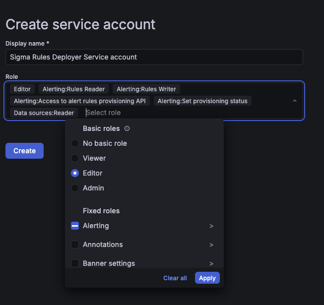
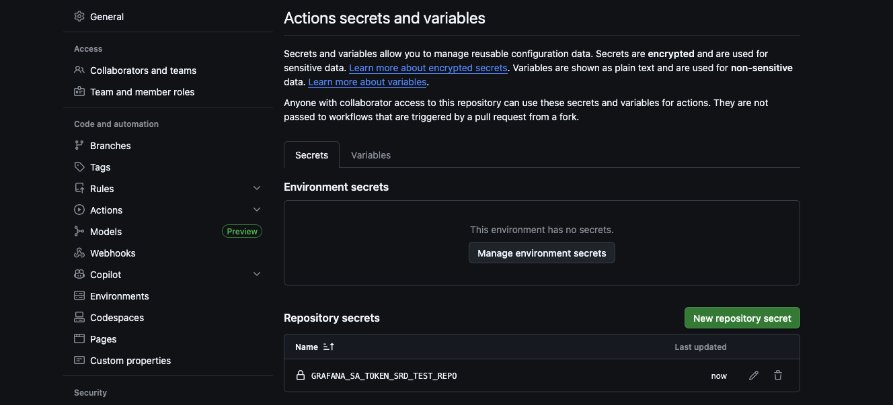
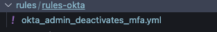
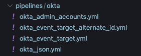
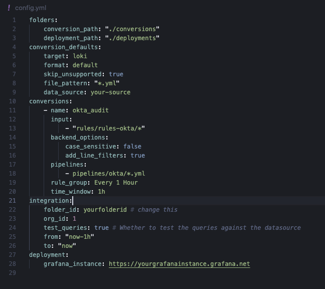
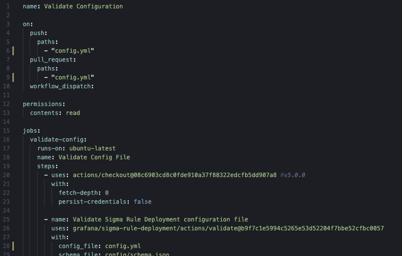
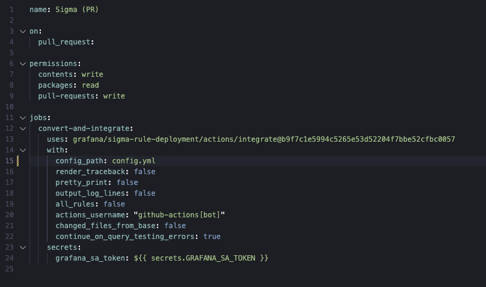
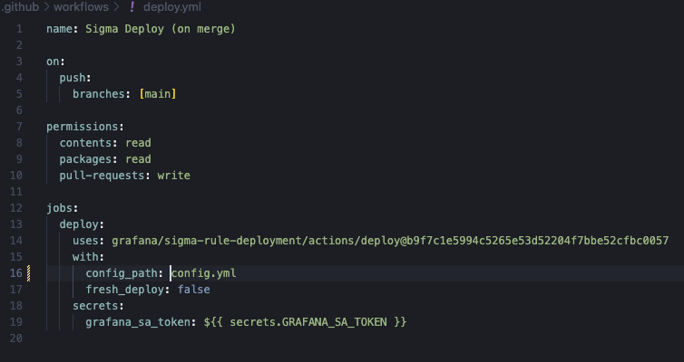
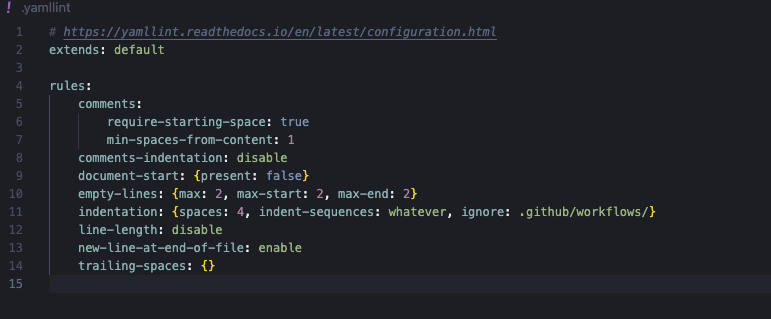

# Getting Started with Sigma Rule Deployment

Welcome! 👋 This guide will walk you through setting up automated Sigma rule deployment to Grafana Alerting using GitHub Actions. By the end of this guide, you'll have a fully automated Detection as Code pipeline that converts, validates, tests, and deploys your Sigma rules with every commit.

## Prerequisites

Before you begin, make sure you have:
- A GitHub account with repository creation permissions
- Access to a Grafana instance ([Grafana Cloud](https://grafana.com/products/cloud/) or [self-hosted](https://grafana.com/grafana/download)). If you don't, we'll cover how to set up your Grafana Cloud Account.
- Basic familiarity with GitHub Actions and YAML configuration files
- Your Sigma rules ready to deploy (or you can start with examples)

## Step 1: Create Your GitHub Repository

First, you'll need a GitHub repository to store your Sigma rules, pipelines, and automation workflows. You have two options:

- **Create a new repository**: If you're starting fresh, create a new GitHub repository that will serve as your Sigma rules repository
- **Use an existing repository**: If you already have a repository with your Sigma rules, you can add the automation workflows to it

This repository will become your single source of truth for detection rules.

## Step 2: Set Up Your Grafana Cloud Account

If you don't already have a Grafana instance, you'll need to set one up. Grafana Cloud offers a free tier that's perfect for getting started.

📚 **Learn more**: [Get Started with Grafana Cloud](https://grafana.com/docs/grafana-cloud/get-started/)

Whether you're using Grafana Cloud or a self-hosted instance, make sure you have access to create service accounts and alert rules.

## Step 3: Generate a Service Account Token

To enable automated deployments, you'll need to create a service account token with the appropriate permissions. This token will allow GitHub Actions to authenticate with your Grafana instance and manage alert rules on your behalf.
Note this needs administrator [privileges](https://grafana.com/docs/grafana/latest/administration/service-accounts/#before-you-begin)

### Creating the Service Account

1. Navigate to your Grafana instance's administration panel
2. Create a new [Grafana service account](https://grafana.com/docs/grafana/latest/administration/service-accounts/)
3. Assign the following permissions to ensure the automation can function properly:

**Required permissions:**
- **Editor** role (simplest option), OR the following specific RBAC roles:
  - Alerting: Access to alert rules provisioning API
  - Alerting: Rules Reader
  - Alerting: Rules Writer
  - Alerting: Set provisioning status
  - Data sources: Reader

4. Generate a token for this service account and copy it securely



### Adding the Token to GitHub Secrets

Security is crucial! Never commit your Grafana token directly to your repository. Instead, store it as a GitHub secret:

1. Navigate to your GitHub repository
2. Go to **Settings** → **Secrets and variables** → **Actions**
3. Click **New repository secret**
4. Name your secret (e.g., `GRAFANA_SA_TOKEN`)
5. Paste your service account token as the value
6. Save the secret

📚 **Learn more**: [Using secrets in GitHub Actions](https://docs.github.com/en/actions/security-for-github-actions/security-guides/using-secrets-in-github-actions)



## Step 4: Organize Your Sigma Rules and Pipelines

Now it's time to add your Sigma rules and conversion pipelines to your repository. Following the [SigmaHQ/sigma](https://github.com/SigmaHQ/sigma) convention helps maintain consistency and makes your repository easier to navigate.

### Folder Structure

We recommend organizing your repository like this:

```
your-repo/
├── rules/                    # Your Sigma rules
│   ├── production/          # Production environment rules
│   ├── staging/             # Staging environment rules
│   └── test/                # Test rules
├── pipelines/               # Sigma conversion pipelines
│   ├── datasources/         # Data source configurations
│   └── production.yml       # Pipeline definitions
├── config/                  # Configuration files
│   └── config.yml          # Main conversion configuration
└── .github/
    └── workflows/           # GitHub Actions workflows
```

### Adding Rules

Create a folder structure for your rules. It's often convenient to organize rules by environment (production, staging, development) or by detection category (network, endpoint, cloud, etc.).



**Tips for organizing rules:**
- Use descriptive folder names that reflect your environment or detection categories
- Keep related rules together
- Consider using subdirectories for better organization as your rule collection grows

### Adding Pipelines

Sigma pipelines define how your rules will be transformed for specific backends (like Loki or Elasticsearch). Create a `pipelines` folder and add your pipeline configuration files there.



**What are pipelines?** Pipelines are YAML files that specify field mappings, transformations, and backend-specific configurations. They tell the converter how to translate generic Sigma rules into backend-specific queries.

📚 **Learn more**: [Sigma Pipelines Documentation](https://sigmahq.io/docs/digging-deeper/pipelines.html)

## Step 5: Create Your Configuration File

The configuration file is the heart of your automation. It defines which rules to convert, which backend to use, and how to deploy them to Grafana.

Create a configuration file (typically named `config.yml`) in your repository. This file will specify:

- Which Sigma rules to process
- Which conversion backend to use (e.g., Loki, Elasticsearch)
- Which Grafana data source to target
- Alert rule settings (folder, group, evaluation interval, etc.)



**Pro tip**: Start with a sample configuration and customize it for your environment. You can find example configurations in the repository:
- [config-example.yml](config/config-example.yml) - Complete example with comments
- [schema.json](config/schema.json) - Configuration schema for validation

The configuration file uses YAML format and includes sections for:
- **Conversions**: Define which rules to convert and how
- **Data sources**: Specify which Grafana data source to use
- **Alert settings**: Configure folders, groups, intervals, and more
- **Query models**: Customize the generated queries for your data source

## Step 6: Set Up GitHub Actions Workflows

GitHub Actions workflows automate the entire process of validating, converting, and deploying your Sigma rules. You'll need to create three workflows:

### 1. Validation Workflow

This workflow runs on pull requests to validate your config files before they're merged. It catches errors early and ensures code quality.



**What it does:**
- Checks configuration file against the schema
- Runs YAML linting to ensure proper formatting
- Provides feedback directly in your pull requests

📚 **Learn more**: [Config Validator Action Documentation](actions/validate/README.md)

### 2. Sigma Validation Workflow

The [SigmaHQ Sigma Rules Validator](https://github.com/SigmaHQ/sigma-rules-validator) is an official GitHub Action that helps ensure that rules are correctly formatted and will work with Sigma converters and the actions in this repository.

**Key Benefits:**
- Validates rules against the official [Sigma specification JSON schema](https://github.com/SigmaHQ/sigma-specification)
- Catches formatting errors early in your CI/CD pipeline
- Ensures compatibility with Sigma conversion tools

📚 **Learn more**: [Sigma Validation Action Documentation](actions/sigma-validation/README.md)

### 3. Convert & Integrate Workflow

This workflow converts your Sigma rules to Grafana-compatible alert rules and tests them against your data sources. It runs on pull requests to show you exactly what will be deployed.



**What it does:**
- Converts Sigma rules using the specified backend
- Generates Grafana alert rule configurations
- Optionally tests queries against your data sources
- Creates a preview of what will be deployed

**Note**: You can trigger this workflow manually or via PR comments (e.g., `sigma convert all`) depending on your workflow configuration.

📚 **Learn more**: [Sigma Rule Converter Documentation](actions/convert/README.md) | [Grafana Query Integrator Documentation](actions/integrate/README.md)

### 4. Deploy Workflow

This workflow automatically deploys your alert rules to Grafana when changes are merged to your main branch. This is where the magic happens!



**What it does:**
- Deploys alert rules to your Grafana instance
- Supports incremental updates (only changed rules) or fresh deployments
- Provides deployment status and feedback
- Ensures your Grafana instance stays in sync with your repository

📚 **Learn more**: [Sigma Rule Deployer Documentation](actions/deploy/README.md)

### Important: YAML Linting Configuration

Don't forget to add a `.yamllint` configuration file to keep the YAML linting workflow happy! This ensures consistent formatting across all your YAML files.



**Pro tip**: Copy the `.yamllint` file from this repository or create one with your team's preferred YAML style guidelines.

## Next Steps

Congratulations! 🎉 You've completed the basic setup. Here's what you should do next:

1. **Test your setup**: Create a test PR with a simple Sigma rule to verify the workflows run correctly
2. **Review the output**: Check the GitHub Actions logs to ensure conversion and integration work as expected
3. **Merge and deploy**: Once satisfied, merge your PR to trigger the deployment workflow
4. **Configure notifications**: Set up [Grafana Alert Notifications](https://grafana.com/docs/grafana/latest/alerting/configure-notifications/) for your newly deployed rules
5. **Iterate and improve**: Add more rules, refine your configuration, and optimize your detection pipeline

## Additional Resources

- [Main README](README.md) - Comprehensive documentation
- [Configuration Schema](config/schema.json) - Detailed configuration options
- [SigmaHQ Documentation](https://sigmahq.io/) - Sigma rule specification
- [Grafana Alerting Documentation](https://grafana.com/docs/grafana/latest/alerting/) - Learn about Grafana alerting

## Getting Help

If you run into issues or have questions:

- Check the [FAQ section](README.md#faq) in the main README
- Review the documentation for each action in the `actions/` directory
- Open an issue in the repository for bugs or feature requests

Happy detecting! 🔍🚀
