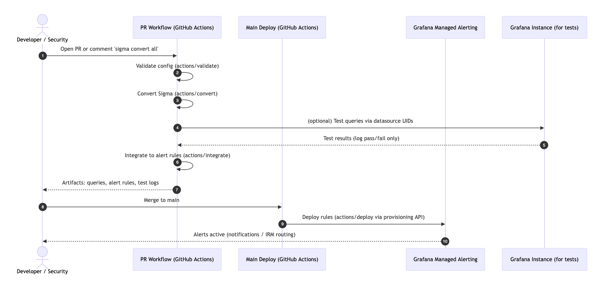

# Sigma Rule Deployment GitHub Actions Suite

Automate the conversion, testing, and deployment of [Sigma rules](https://sigmahq.io/) to [Grafana Alerting](https://grafana.com/docs/grafana/latest/alerting/) rules with GitHub Actions using a [Detection as Code](./README.md#what-is-detection-as-code) approach using a declarative configuration file.

## Available Actions

- [**Config Validator**](./actions/validate/README.md): Validates configuration files against the JSON schema to ensure proper structure and required fields before processing.
- [**Sigma Rule Validation**](./actions/sigma-validation/README.md): Before converting and deploying your Sigma rules, we strongly recommend validating them to ensure they conform to the [Sigma specification](https://sigmahq.io/docs/). Use the [SigmaHQ Sigma Rules Validator](https://github.com/SigmaHQ/sigma-rules-validator) GitHub Action to automatically validate your rules in your CI/CD pipeline.
- [**Sigma Rule Converter**](./actions/convert/README.md): Converts Sigma rules to target query languages using `sigma-cli`. Supports dynamic plugin installation, custom configurations, and output management, producing JSON output files containing converted queries and rule metadata.
- [**Grafana Query Integrator**](./actions/integrate/README.md): Processes the JSON output from the Sigma Rule Converter and generates Grafana-compatible alert rule configurations, bridging the gap between converted Sigma rules and Grafana alerting.
- [**Sigma Rule Deployer**](./actions/deploy/README.md): Deploys alert rule files to Grafana, supporting both incremental deployments (only changed files) and fresh deployments (complete replacement).

## Usage

1. Create a GitHub repository and add the [Sigma rules](https://sigmahq.io/docs/basics/rules.html) and [pipelines](https://sigmahq.io/docs/digging-deeper/pipelines.html) you want to convert
   - Following the main [SigmaHQ/sigma](https://github.com/SigmaHQ/sigma) convention, we put our rules into folders starting with `rules`, and we put our Sigma pipelines in a `pipelines` folder
   - Note that any [Sigma correlation rules](https://sigmahq.io/docs/meta/correlations.html) you want to convert must have the rules they reference in the same file (see [the FAQ](#faq))
2. Create a [Grafana service account token](https://grafana.com/docs/grafana/latest/administration/service-accounts/) and [add it as a secret](https://docs.github.com/en/actions/security-for-github-actions/security-guides/using-secrets-in-github-actions) to your GitHub repository
   - Ensure the service account is either an Editor and/or has the following [RBAC roles](https://grafana.com/docs/grafana/latest/administration/service-accounts/#assign-roles-to-a-service-account-in-grafana):
     - Alerting: Access to alert rules provisioning API
     - Alerting: Rules Reader
     - Alerting: Rules Writer
     - Alerting: Set provisioning status
     - Data sources: Reader
3. Create a configuration file that defines one or more conversions and add it to the repository
   - See the sample [configuration file](config/config-example.yml)
   - See also the [configuration file schema](config/schema.json) for more details
4. Add a workflow to run the conversion/integration Actions on a PR commit or issue comment
   - See the reusable workflow [convert-integrate.yml](.github/workflows/convert-integrate.yml)
5. Add a workflow to run the deployment Action on a push to main
   - See the reusable workflow [deploy.yml](.github/workflows/deploy.yml)
6. Create a PR that adds or modify a converted Sigma rule, and add a comment `sigma convert all` to the PR to see the conversion and integration process in action
7. Once you're happy with the results, merge the PR into main, which will trigger the deployer to provision the Alerting rules to your Grafana instance
8. With the alert rules successfully provisioned, set up [Alerting notifications](https://grafana.com/docs/grafana/latest/alerting/configure-notifications/) for the relevant folder and/or groups to directly contact affected users. Alternatively you can connect them to [Grafana IRM](https://grafana.com/docs/grafana-cloud/alerting-and-irm/irm/) and use it to manage on-call rotas and simplify alert routing

## FAQ

### What backends/data sources do you support?

These Actions can convert rules using **any** Sigma backend and produce valid alert rules for **any** data source, however, to date they have only been thoroughly tested with Loki and Elasticsearch. In particular, converting log queries into metric queries so they can be used correctly with Grafana Managed Alerting is dependent on the backend supporting that option or by modifying the generated queries using the `query_model` option.

Relevent conversion backends and data sources that can be used in Grafana include:

| Sigma Backend                                                             | Data Source                                                                                     | Supported Integration Method |
| ------------------------------------------------------------------------- | ----------------------------------------------------------------------------------------------- | ---------------------------- |
| [Grafana Loki](https://github.com/grafana/pySigma-backend-loki)           | [Loki data source](https://grafana.com/docs/loki/latest/)                                       | Native                       |
| [Elasticsearch](https://github.com/SigmaHQ/pySigma-backend-elasticsearch) | [Elasticsearch data source](https://grafana.com/docs/grafana/latest/datasources/elasticsearch/) | Native                       |
| [Azure KQL](https://github.com/AttackIQ/pySigma-backend-kusto)            | [Azure Monitor data source](https://grafana.com/docs/grafana/latest/datasources/azure-monitor/) | Custom Model                 |
| [Datadog](https://github.com/SigmaHQ/pySigma-backend-datadog)             | [Datadog data source](https://grafana.com/grafana/plugins/grafana-datadog-datasource/)          | Custom Model                 |
| [QRadar AQL](https://github.com/IBM/pySigma-backend-QRadar-aql)           | [IBM Security QRadar data source](https://grafana.com/grafana/plugins/ibm-aql-datasource/)      | Custom Model                 |
| [Opensearch](https://github.com/SigmaHQ/pySigma-backend-opensearch)       | [Opensearch data source](https://grafana.com/grafana/plugins/grafana-opensearch-datasource/)    | Custom Model                 |
| [Splunk](https://github.com/SigmaHQ/pySigma-backend-splunk)               | [Splunk data source](https://grafana.com/grafana/plugins/grafana-splunk-datasource/)            | Custom Model                 |
| [SQLite](https://github.com/SigmaHQ/pySigma-backend-sqlite)               | [SQLite data source](https://grafana.com/grafana/plugins/frser-sqlite-datasource/)              | Custom Model                 |
| [SurrealQL](https://github.com/SigmaHQ/pySigma-backend-surrealql)         | [SurrealDB data source](https://grafana.com/grafana/plugins/grafana-surrealdb-datasource/)      | Custom Model                 |

- **Native**: The data source plugin is supported by integrate action and the query model is generated automatically.
- **Custom Model**: The data source plugin is supported by the integrate action but the query model must be passed as a custom model in the conversion configuration.

### Why can't I use log queries with alert rules?

> [!IMPORTANT]
> [Alert rules](https://grafana.com/docs/grafana/latest/alerting/fundamentals/alert-rules/) only work with metric queries, not log queries.

#### 1. Data source compatibility

Data source plugins vary in their support for metric queries and the generated query from the convert action for Sigma rules will often only produce a log query, not a metric query. In contrast, a converted Sigma Correlation rule will generally produce a metric query, which can be used directly in the alert rule.

- **Native support**: Some data sources, such as Loki, can [apply metric functions](https://grafana.com/docs/loki/latest/query/metric_queries/) to log queries
- **Limited support**: Other data source, including the [Elasticsearch data source](https://grafana.com/docs/grafana/latest/datasources/elasticsearch/), do not support metric queries through their native query language, but their log query response can include metric metadata (e.g., counts)

#### 2. Custom query models

For data sources that lack native metric query support, you must provide a custom query model using the `query_model` configuration option (see [How can I use a custom query model for a data source?](#how-can-i-use-a-custom-query-model-for-a-data-source)).

The query model is a JSON object that defines the data source query structure for query execution.

<!-- #### SQL expressions for metric queries

When using the `query_model` option, you can leverage Grafana [SQL Expressions](https://grafana.com/docs/grafana/latest/panels-visualizations/query-transform-data/sql-expressions/) to transform log queries into metric queries:

```sql
SELECT COUNT(*) FROM A
```

**Note**: SQL expressions are only [compatible](https://grafana.com/docs/grafana/latest/panels-visualizations/query-transform-data/sql-expressions/#compatible-data-sources) with certain data source plugins. -->

### How can I use a custom query model for a data source?

To ensure the data source plugin can execute your queries, you may need to provide a bespoke `query_model` in the conversion configuration. You do this by specifing a [fmt.Sprintf](https://pkg.go.dev/fmt#pkg-overview) formatted JSON string, which receives the following arguments:

1. the ref ID for the query
2. the UID for the data source
3. the query, escaped as a JSON string

An example query model would be:

```yaml
query_model: '{"refId":"%s","datasource":{"type":"my_data_source_type","uid":"%s"},"query":"%s","customKey":"customValue"}'
```

Or for Elasticsearch:

```yaml
query_model: '{"refId":"%s","datasource":{"type":"elasticsearch","uid":"%s"},"query":"%s","alias":"","metrics":[{"type":"count","id":"1"}],"bucketAggs":[{"type":"date_histogram","id":"2","settings":{"interval":"auto"}}],"intervalMs":2000,"maxDataPoints":1354,"timeField":"@timestamp"}'
```

Other than the `refId` and `datasource` (which are required by Grafana), the keys used for the query model are data source dependent. They can be identified by testing a query against the data source with the [Query inspector](https://grafana.com/docs/grafana/latest/explore/explore-inspector/) open, going to the Query tab, and examining the items used in the `request.data.queries` list.

### Are there any restrictions on the Sigma rule files?

The main restriction are they need to be valid Sigma rules, including the `id` and `title` [metadata fields](https://sigmahq.io/docs/basics/rules.html#available-sigma-metadata-fields). If you are using [Correlation rules](https://github.com/SigmaHQ/sigma-specification/blob/main/specification/sigma-correlation-rules-specification.md), the rule files must contain **all** the referenced rules within the rule file (using [YAML's multiple document feature](https://gettaurus.org/docs/YAMLTutorial/#YAML-Multi-Documents), i.e., combined with `---`).

> [!IMPORTANT]
> The [Sigma Rules Validator](https://github.com/SigmaHQ/sigma-rules-validator) action does not currently work with multiple documents in a single YAML and hence we recommend storing such rules in a separate directory from the Sigma rules. More info can be found [here](./actions/sigma-validation/README.md)

### What value should be provided for the `data_source` field in the `conversion` settings?

This should be the UID (Unique IDentifier) of the data source, not the data source name. You can find the UID for a data source by opening the Explore page, selecting the relevant data source, and examining the page URL for the text `"datasource":"XXX"` - that value (i.e., `XXX`) is the UID.

### What impact do the Loki backend options `add_line_filters` and `case_sensitive` have on my queries?

The pySigma Loki backend supports two optional boolean flags:

1. `add_line_filters`: adds an additional line filter to each query without one, using the longest values being searched for, to help reduce the volume of results being parsed
2. `case_sensitive`: changes the default behaviour of Sigma string matches to be case sensitive

The imapct of these two flags are different:

1. Line filters can basically be enabled in all contexts - it's a performance enhancement that should never affect the results a query brings back
2. Changing the case sensitivity of Sigma rules carries some risk. Whilst some logs, like audit logs should be case sensitive, others may not be which _could_ mean certain rules potentially miss logs with it enabled, and some rules may not bring back **any** results. In general, if there's **any** possibility the values being searched for in the rules are user-entered, we would strongly recommend using `case_sensitive: false` (which is also the default), otherwise it can usually be true as its queries will be more performant (but you may want to try testing it with a known example)

### How do these Actions interact?



### What is Detection as Code?

Detection as Code (DaC) is a practice where security detection rules are:

- Stored as structured, human-readable files
- Managed in a version-controlled environment (like Git) to track all changes
- Deployed through automated pipelines to ensure consistency and traceability

The goal is to manage the entire lifecycle, from developing accurate detection rules to deploying the database queries and configuring alert systems, all within a single, versioned environment.

#### How does Sigma Rule Deployment implement DaC?

This project helps you achieve Detection as Code using Sigma rules, GitHub, and Grafana:

- Sigma rules provide a standardized format for storing detection logic with thousands of community examples
- Sigma CLI converts these rules into queries compatible with multiple database systems (Loki, Elasticsearch, etc.)
- Grafana executes those queries on a schedule and triggers alerts via Grafana IRM when detections occur

Sigma Rule Deployment automates this workflow: it provides GitHub Actions to convert Sigma rules to queries, validates their functionality, and provisions them to Grafana as alert rules; making security monitoring more reliable and maintainable.

## Releasing

To release new versions of sigma-rule-deployment, we use Git tags to denote an officially released version, and automation to push the appropriately tagged Docker image. When the main branch is in state that is ready to release, the process is as follows:

1. Determine the correct version number using the [Semantic Versioning](https://semver.org/) methodology. All version numbers should be in the format `\d+\.\d+\.\d+(-[0-9A-Za-z-]+)?`
2. Create a PR to update **all** the version tags used in the reusable workflows [convert-integrate.yml](.github/workflows/convert-integrate.yml) and [deploy.yml](.github/workflows/deploy.yml) to the new version, and merge it into `main` once it is approved, e.g.:
```
        uses: grafana/sigma-rule-deployment/actions/convert@vX.X.X
```
3. Checkout `main` and create a signed tag for the release, named the version number prefixed with a v, e.g., `git tag --sign --message="Release vX.X.X" vX.X.X`
4. Push the tag to GitHub, e.g., `git push --tags`
5. Create a release in GitHub against the appropriate tag. If the version number starts with `v0`, or ends with `-alpha/beta/rcX` etc., remember to mark it as a pre-release
6. Validate that the "Build Consolidated Image" action, which pushes the tagged image to the GitHub Container Repository (GHCR), has completed successfully for the Release action
