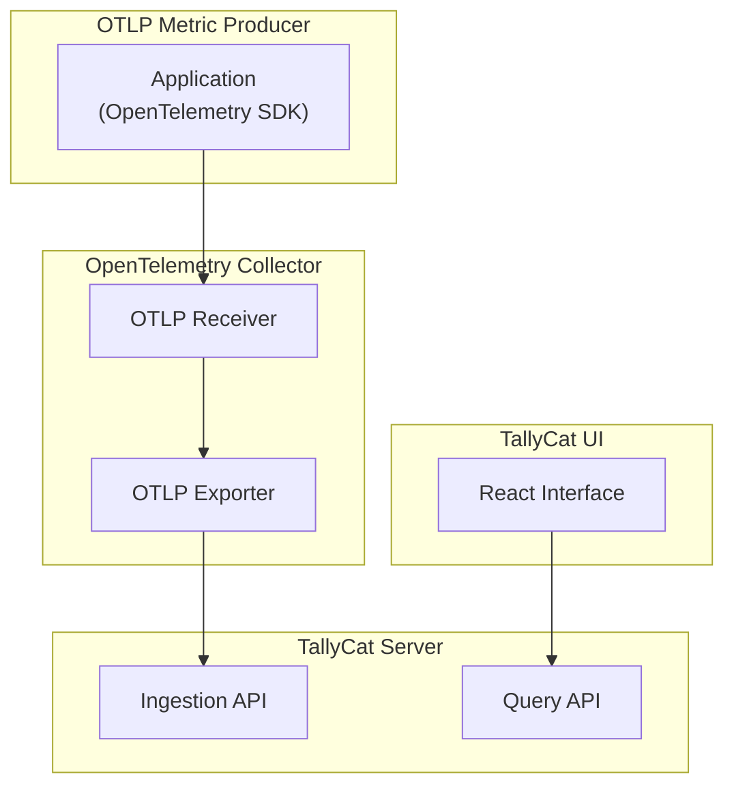

# 📦 TallyCat MVP Specification (Metrics-Only)

## 🎯 Goal

The MVP enables teams to **bootstrap schema-first observability for metrics** using OpenTelemetry by:

- Inferring metric schemas in real-time from OTLP data
- Producing structured schema metadata aligned with OpenTelemetry conventions
- Tracking schema versions, producers, and evolution over time

This unlocks visibility, deduplication, and governance for emitted metrics — without requiring changes to instrumentation.

---

## 🧩 Features

### ✅ Feature: Schema Runtime Inference

TallyCat ingests OTLP metric data and **automatically infers the telemetry schema**. It tracks:
- Field names, types, and source (resource, scope, data)
- Metric metadata like unit, type, and temporality
- Multiple schema shapes for the same telemetry signal (e.g., same metric emitted with different tags)

Each unique shape is assigned a deterministic schema ID.  
Schemas are grouped by `schema_key` (e.g., metric name), allowing tracking of divergent versions emitted by different services.

---

### ✅ Feature: Version Assignment

TallyCat supports assigning **semantic versions to inferred schemas**:
- Users can tag any schema with a version string (e.g., `1.0.0`)
- Each version includes optional status (`active`, `deprecated`) and a reason
- This allows schema producers and consumers to coordinate and reason about changes over time

One telemetry signal (e.g., `http.server.duration`) may have **multiple schema versions** in parallel — each tracked independently.

---

## 🛠️ Tech Stack

TallyCat is built using modern, fast, and developer-friendly tooling:

### Backend
- **Language**: Go (Golang)
- **Collector Integration**: OpenTelemetry Connector (OTLP)
- **Metadata Storage**: DuckDB  
  > Used for local development and MVP scope only — production-ready backends will be explored later (e.g., SQLite, Postgres, Parquet on object storage).

### Frontend
- **Framework**: React 18 + Vite
- **UI Toolkit**: shadcn/ui + Tailwind CSS
- **Routing**: TanStack Router
- **Data Fetching**: TanStack Query (React Query)
- **Language**: TypeScript

## 🗺️ Architecture Diagram

---

## ✅ MVP Scope

### 1. Metric Schema Inference
- Input: OTLP metrics (real-time ingestion)
- Captures:
  - Metric name
  - Unit, metric type, temporality
  - Description
  - Attributes from resource, scope, and data point levels
  - Field types and source
- Produces a deterministic schema ID per shape

### 2. Schema Producer Tracking
- Associates schema with producer identity (service name, namespace, version, instance ID)
- Tracks `first_seen` and `last_seen` timestamps
- Enables ownership mapping and usage insight

### 3. Schema Versioning
- Semantic versions are assigned manually
- Status and rationale are captured
- Multiple schemas can exist per metric key

---

## 💾 Metadata Storage Model

(DuckDB-backed, see prior versions for schema table breakdown)

---

## 📈 Core Behaviors

- Multiple unique schemas can be observed for the same metric
- Schema changes are tracked over time
- Producers are de-duplicated and monitored
- Manual versions provide governance signals

---

## 🔜 Post-MVP Goals

- Add support for logs and spans
- Schema diffing and auto-versioning
- GitOps exports and schema validation
- Alert/dashboard analysis and linting
- Cost modeling and signal prioritization
- Policy-based enforcement (e.g., field bans)

---

## 📌 Summary

TallyCat’s MVP is a **schema-first catalog for OpenTelemetry metrics**, enabling teams to discover and control the telemetry they already emit.  
It brings structure and visibility to a space traditionally left ungoverned — starting with metrics, and scaling to broader observability governance.